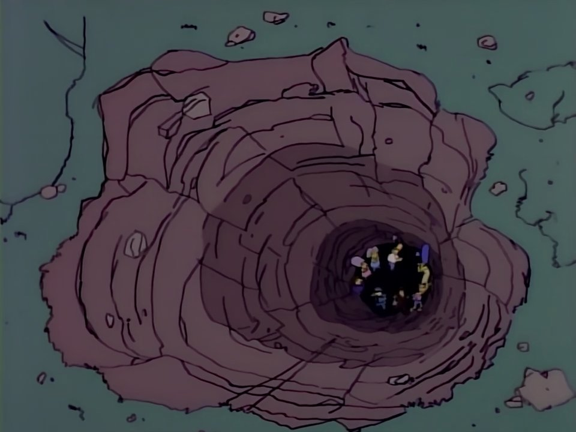
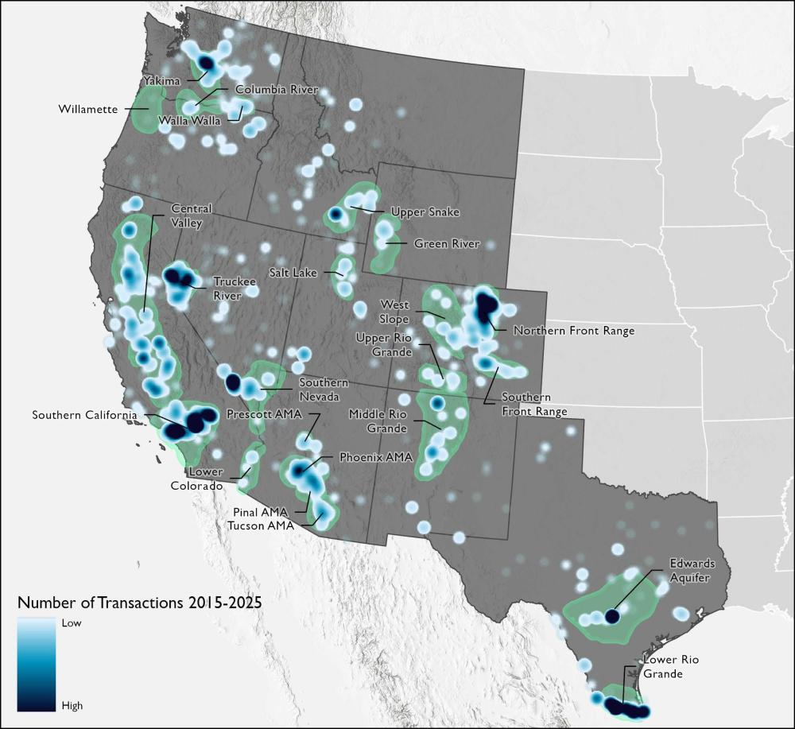

One of the main things I would like to communicate to people about water in the US West is that capitalism's problem with water is not just scarcity but the dynamism of fresh water supplies. To state the obvious, fresh water is produced through an annual climatic cycle, and how much water becomes available for human consumption varies quite dramatically year to year. Because water is necessary in some amount for every economic activity in the region, investment depends on a steady, reliable supply. Dams have gone a long way in smoothing out the supply curve of Western rivers and streams that flow from mountain snowpacks, but every water user faces variability to some degree.

While it is not fully accurate (just as giving disproportionate attention to water scarcity is not fully accurate), one could engage in a thought experiment that reframes *surplus* as the problem to be solved. Irrigation dams in the nineteenth-century, in this light, solved the problem of surplus "flood" waters in the spring, which arrived when farmers had little need of them. Storing this surplus water, which was otherwise "wasted" if allowed to flow to the ocean or to seep into underground aquifers, met existing demands while allowing Western states to attract more settlers. 

The era of building dams is over, and while all of this elaborate engineering has gone a long way in mitigating dramatic swings in water supply from year to year, human demand is unable to sync up perfectly with a variable supply. People move, and industries rise and fall, influenced by economic cycles. This means that in drought periods, industry might experience shortages. In wet periods, there might be surplus water that fails to be put to its highest use -- which is similarly intolerable to capitalist logic, especially in a region that depends so heavily on in-migration to fuel economic growth. 

So the prevailing view is that we desperately need water marketing. With robust markets for trading water, we can seemingly continue to pursue the dream of tightly calibrated supply and demand curves. Popular reporting and opinion does not typically reflect the policy discourse that happens among experts and professionals, but both tend to view the problem as the misallocation of a scarce good. Pursuing this line of thought lobs the question squarely into economists' court. Economists are given extra deference in our current era, in which nearly every policy problem is assumed at base to be a matter of economics. Conventional wisdom holds that water, specifically, was ruinously mishandled by government and its profligate subsidies. It's the sort of problem that economics was designed to fix, and markets are the discipline's foremost tool.

One of the observations I would like to make about water markets is that using them as the solution is a little too textbook -- suspiciously so. I contend that water marketing is largely a solution in search of a problem. There are more complexities than water marketing can address (or have addressed), and fitting these markets to real world conditions inevitably lands us back in the realm of the political. 

Going along with that, water marketing is sometimes characterized as a radical departure from the West's existing scheme, based on the prior appropriation doctrine. In reality, depending to some degree on the details, water markets already exist. Reforming those markets can entail -- and has entailed -- some significant tweaks to water law. But if you want to buy and sell water rights, I have great news for you! "[Water trading](https://www.nasdaq.com/products/global-indexes/thematic/veles-water) occurs in every western state, with more than 20 distinct regions where market activity routinely occurs."

The following will not be any kind of systematic review of water marketing proposals but rather a scattershot sampling of what's out there. And there are plenty of these out there. There are rather explicit ideological proposals from think tanks as well as more nuanced takes from academics and professionals, but the rough consensus in Western water policy seems to be that water marketing should play some role in reforming Western water use patterns.

There are two goals here: channeling water toward higher-value uses and reducing overall water consumption. Many think that these are entirely complementary goals, and I disagree. But framing the problem as an economic one makes a market intervention appear both obvious and sophisticated. The Hamilton Project, a Brookings Institution initiative whose goal is "to advance America's promise of opportunity, prosperity, and growth," published a [policy brief](https://www.hamiltonproject.org/wp-content/uploads/2023/01/how_the_market_can_mitigate_water_shortage_in_west_brief.pdf) in 2014 titled "Shopping for Water: How the Market Can Mitigate Water Shortages in the American West." The authors put it bluntly: "In sum, water scarcity is an economic problem that demands an economic solution."

But this is not true! Water scarcity is a political problem, and these types of statements are doing political work in steering the politics of water toward market reform. Consider for instance the looming crisis on the Colorado River. Seven states are trying to get as much water as possible from a dwindling river while also keeping the system limping along. Is there a purely economic explanation for the Colorado River Compact or for why the federal government continues to sit back and let the states tussle over its infrastructure? Naturally, Western states are thinking about their future economic growth, but this is why "political economy" is such a useful frame of reference.

A few paragraphs before their statement about economic solutions, the authors note that one of the challenges facing surface water markets is the ability of water users to access groundwater. "In the absence of regulation, a prospective water user will choose to access free groundwater instead of paying for access to a more sustainable, but comparatively expensive, supply of surface water." This is a great point! But what exactly is the economic solution for regulating groundwater?

In fact, farmers' access to groundwater is one factor that led the Bureau of Reclamation to offer such generous contracts with irrigation districts. People seem to commonly reverse cause and effect when talking about the subsidization of federal irrigation projects. For example, when proposing the initial contracts for the [Central Arizona Project](https://gspp.berkeley.edu/archived/files/research/pdf/cap.pdf), agricultural and municipal & industrial agencies alike suggested that their demand was higher than what resulted when the project began delivering water. Partly because of cheaper access to groundwater, Reclamation was forced to lower its prices for contracts in order to remain competitive so it could recoup construction costs. As a result, cheap CAP water went undersubscribed for a time. To be clear, there are not many defenders of Reclamation's financial practices, and I am not one of them. Their problems were largely self-inflicted. But I find the common interpretation of agricultural water subsidies, based on "porkbarrel" spending and/or bureaucratic inefficiency, to be highly ideological and misleading in its omission of other motivators for building expensive dam projects. Regardless of fiscal, geographic, or hydrological concerns, the CAP was necessary for Arizona to access its share of the Colorado River. That alone is entirely sufficient as an explanation for why it was built. 

I was being a little flip in declaring that water markets already exist, since there are considerable legal concerns that inhibit trading for many water appropriators. But I think it's important to highlight to the general reader that the conversation is about reform rather than the creation of an entirely new animal. The Hamilton Project paper points to the existence of rules in Western states that require water users to "document the new location, purpose, and use of the water before it can be transferred." This is known as the "anti-speculation doctrine," in their words. I won't necessarily defend the doctrine's name, but I can't pass up the opportunity to point out that the authors' proposal to "jettison" the anti-speculation doctrine is a little on the nose. In a [report](https://www.perc.org/wp-content/uploads/2022/09/PPR-Water-Markets-220916-WEB.pdf) for the Property and Environment Research Center, a free-market think tank, two contributors go so far as to affirm the place of speculators in an ideal water market: "The participation of speculators accelerates trading and creates a robust environment that can easily allow hedgers [traders that rely on water] to transfer risk." If you say so!

Historically, the purpose of this type of anti-speculation rule was to promote the use of water for the development of land and to discourage trading on water itself. This makes it difficult for water users to make short-term transfers or leases that reflect shifts in supply. But if the goal is to shift water supplies to conservation, states can (and have) relaxed rules around beneficial use or included conservation as a recognized use that will not lead to loss of their water right. That can happen independent of market reform. 

But beyond the (intentional) checks on water rights transfers under the prior appropriation doctrine, these transfers are limited in scope by geography: "The physical difficulty and expense of moving large quantities of water pose significant challenges to getting water to where it is needed." As a partial remedy, the Hamilton Project calls for the introduction of options contracts "to insure against costs associated with inevitable supply disruptions." (Remember my argument that the primary goal is to allow demand to pivot as quickly as supply?) At a certain point, this type of thing begins to read to me like shaping real-world markets to be more like the ones that economists dream up. The [Public Policy Institute of California](https://www.ppic.org/publication/californias-water-market/) (in 2021) points out, "Water sales grew significantly during the 1990s, but trading has stayed flat since then." Part of the reason is that "most trading occurs within the same county (46%) or region (26%)." Their suggestion is to streamline regulatory rules. Another recommendation is to establish groundwater markets with "strong basin accounting systems, caps on how much each water user may pump, and processes to avoid harm to other water users." Again, these are political questions, and I think we should all be wary about deregulation, broadly speaking. The report points to transfers toward environmental uses as part of the promise of markets. But if markets work as intended in raising the price of water, then certainly market-based conservation will become more expensive and more difficult as a result.

Another point that pops up in some of these proposals is that water has a social importance independent of its price as a commodity. As political scientist Dan McCool puts it in his book *Native Waters*, "Markets are an effective means of allocating private economic goods, but they completely lack any sensitivity to nonmarket values. A market has no respect for culture, no long-term understanding of the public good, no sense of justice." Proponents of water marketing will often nod to this concern and treat it as a given that regulations will take such things into account. (I had an example of this, but I am not good at taking notes and lost it). I feel strongly that such matters should not be taken for granted. 

Now let's look at how following the logic of markets leads to unexpected places. I'm really savoring this next one. WestWater Research in a [report](https://westwaterresearch.com/forecasting-californias-water-market/) from earlier this year finds that water market prices in California are highly volatile, depending on the year's natural supply of water. To help remedy this, they support the building of the state's proposed storage and conveyance infrastructure to "reduce peak spot-market prices for water." In other words, the government should resume building dams and pipelines. I'm in awe of how seamlessly the case for markets to sort out the problems with government has become the case for government to sort out the problems with the market. Dig up, stupid!

The contributors to the PERC report also see "storability" as an important factor in helping water markets achieve optimal efficiency, though their recommendation is that this happen in a public-private underground aquifer like the Kern Water Bank. (The notorious Resnicks, owners of the Pom Wonderful company, have a majority interest in this water bank). There's something to be said for using aquifers as storage, though the authors note that even then the Kern Water Bank assumes 10% of banked water lost to evaporation, and transferring water outside of Kern County could incur a further loss of 5%. Marc Reisner, author of *Cadillac Desert*, worked for Vidler Water Company in the 1990s as it pursued a similar scheme. Recent [reporting](https://grist.org/drought/vidler-water-company-housing-dr-horton-nevada-arizona/) about Vidler demonstrates the troubling potential for this type of company to speculate on water even within the traditional bounds of prior appropriation. But again, my point is that engineering was the primary means of smoothing the supply curve of water in the twentieth century; now using markets for that same purpose apparently leads us back to engineering.

You may wonder why we don't simply ditch the prior appropriation doctrine, since it incentivizes the use of water for no apparent reason other than holding on to the water right. A fellow at the [George W. Bush Institute](https://www.bushcenter.org/publications/how-water-markets-would-make-americas-western-cities-sustainable) suggests that we could do just that: "One solution would be for federal and state policymakers to throw out the doctrine of prior appropriation. It exists only in statutory and case law, so lawmakers are free to override it. Then they could auction off water rights over time." I genuinely can't tell if this is a kind of [modest proposal](https://en.wikipedia.org/wiki/A_Modest_Proposal), since it's the single most batshit thing I've ever read about water. The idea that prior appropriation only exists in statutory and case law may be technically true, but more importantly, prior appropriation is foundational to Western society and will simply never be taken up for debate in federal or state legislatures.

To the author's credit, he goes on to walk back his own ludicrous idea: "Overriding prior appropriation rights risks undermining markets, since governments create significant uncertainty when they threaten to revoke or dilute the value of tradeable privileges bestowed in the past... Current rights holders, moreover, would likely sue public authorities for engaging in inappropriate 'taking.'" This is still, somehow, an understatement of the fallout that would come from "throwing out" prior appropriation in the seventeen states that use some version of it. But the author makes an important point: water rights are property, and they are a type of property that rests on the prior appropriation doctrine. Besides, prior appropriation includes the principle that water itself (as opposed to the right to access some amount of it) is public property, managed by the states as a public trust. This provision is found in the constitutions of Western states, for what that's worth. If the argument is that we all should be buying water itself, how do we transfer ownership and to whom? Don't think about it too hard; it won't happen. 

There is another proposal that I came across which recommends raising the price of wholesale water in the Lower Colorado River Basin independent of markets. The [report](https://www.ioes.ucla.edu/wp-content/uploads/2025/12/Water-Pricing-Report.pdf) comes from an institute at UCLA and highlights the disparity between agricultural and municipal & industrial districts in federal water contracts; agricultural districts pay much lower costs on average for federal project water. The authors propose adding a surcharge of about $50 per acre-feet to "provide funding for system resilience or for modernizing aging equipment and infrastructure, while providing a price signal recognizing the scarcity of water." I have no objection.

If Western water problems are indeed economic ones that require economic solutions, then we should, at the very least, factor in land values rather than just water prices. I'm increasingly puzzled by the total lack of attention to this. (I've looked and looked for this type of analysis and come up short! If it's out there please send it to me!) If you ask a historian about the 1902 Reclamation Act, they will likely tell you it was a kind of extension of the 1862 Homestead Act. Few people discuss the Homestead Act in terms of bushels of grain produced; why not consider the effect that Western reclamation had on establishing homes for settlers and raising the price of land?

A brief [proposal](https://www.colorado.edu/center/gwc/ColoradoRiverInsights2025DancingWithDeadpool) from authors at the Kyl Center for Water Policy at Arizona State University gestures in this direction. The proposal calls for conservation easements and land purchases, either adapting existing agricultural land for conservation purposes or taking it out of production. The proposal is modeled after a New Deal program that acquired over 11 million acres. As they correctly note, "Neither agricultural-to-urban transfers nor assigned water programs significantly reduce overall Colorado River demands and neither significantly bolsters collective resilience or system reliability." I think this type of thinking is entirely appropriate, as it gets closer to the core purpose of reclamation and also factors in the key value of resilience. I am leery, however, of the authors' assertion that this is not a "buy and dry" program -- something which has become a byword in the West. A key difference is that, unlike buy and dry programs, municipalities are not buying farmland to retire it and use associated water rights, but I am not sure that Western farmers will have a less severe reaction to the federal government's purchasing of land. It's worth a shot?

If I were to sum up my feelings about water marketing, I would say that I am skeptical about the ability of further liberalized markets to significantly reduce overall water consumption. In theory, markets would be able to smooth out temporal fluctuations in demand for water, which would be preferable to water itself being consumed in a way that mitigates supply shocks. However, I think there are significant real-world obstacles to achieving the desired level of efficiency, and I am highly skeptical that much more of this valuable water would be dedicated to the environment. I am not necessarily opposed to experimenting with the idea, but that is because I expect significant political opposition to introducing complex financial instruments into water markets on a broad scale. Maybe I'm being overly optimistic on that point, which would be unusual for me. Anyway, it may be worth considering the relative advantages of the devil we know, even if what we currently have will not last as it is much longer. We should think critically about what will replace the current status quo. The logic of markets is part of the paradigm that governs our lives: like water, capital wants our labor to exist in discrete, fungible units that move according to economic demand. We can begin to reject that logic and imagine a future where trade is subservient to human needs rather than vice versa. 

