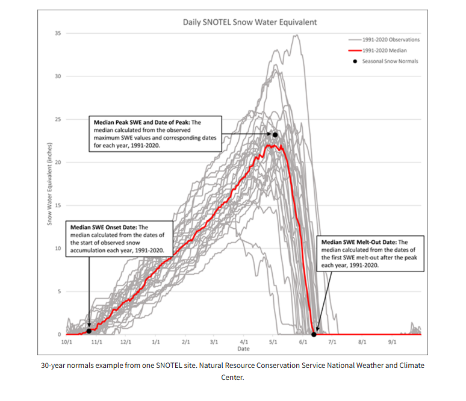
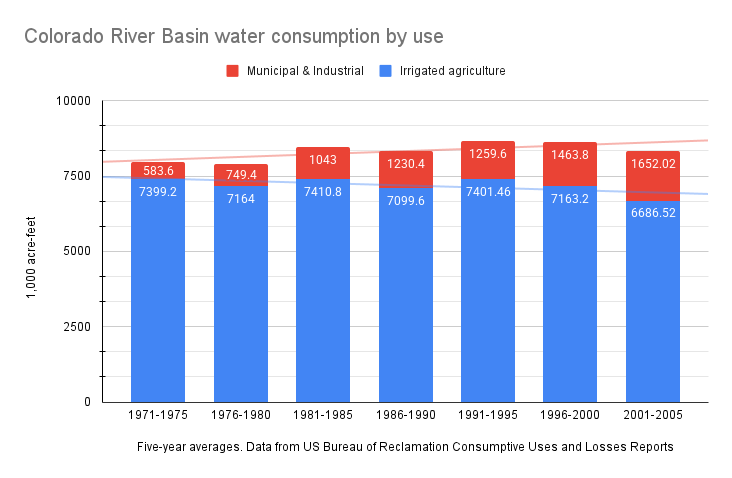
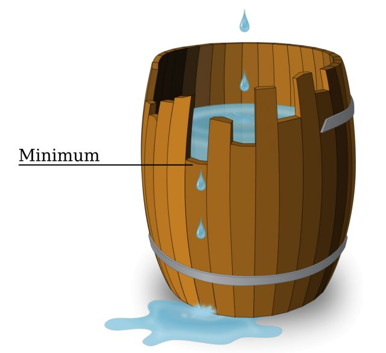

> Agriculture is a rational means/end calculus that is geared to vouchsafing its own reproduction, generating capital that projects into a future where it repeats itself… Agriculture supports a larger population than non-sedentary modes of production… The inequities, contradictions and pogroms of metropolitan society ensure a recurrent supply of fresh immigrants – especially… from among the landless. In this way, individual motivations dovetail with the global market’s imperative for expansion. Through its ceaseless expansion, agriculture (including, for this purpose, commercial pastoralism) progressively eats into Indigenous territory, a primitive accumulation that turns native flora and fauna into a dwindling resource and curtails the reproduction of Indigenous modes of production.
--Patrick Wolfe[@wolfe_settler_2006]

## Part 1 
### Introduction 

When it comes to water in the US West, conservation discourse contains two threads which are in tension with one another. Conservation refers to a set of practices which are now necessary to bring water consumption in line with a dwindling supply and, at the same time, a means of freeing up available water in order to attract continuing investment in the region’s economy. Conventional wisdom about water largely reflects the political imperative to emphasize the areas of overlap between those divergent threads in order to maintain a business environmentalist coalition.^[Business environmentalism is "an amalgam of utilitarianism, preservationism, conservationism, and capitalist interests... It manifested itself through the tight coupling of business and environmental interests." @taylor_rise_2016] This contemporary coalition, which resembles past coalitions with similar political goals, imagines growth as a solution rather than a problem. Because this discourse (especially among the general public) contorts according to political expediency rather than analytical precision, it reproduces demonstrable errors and draws inappropriate conclusions from snippets of fact.

There are sets of overlapping effects that would result from a collective failure to reform the way that we use water in the West. Environmental impacts could include a loss of biodiversity from the drying up of water sources that provide habitat for endangered species; the drying of terminal lakes like Great Salt Lake, Mono Lake, or the Salton Sea; increased wildfire danger from decreased soil moisture; land subsidence from the draining of underground aquifers; and so on. Environmental degradation can lead directly to social and economic disruption, and the mitigation of water stress through rationing could cause the relocation of individuals or communities. Difficulty in obtaining a reliable supply water for industrial or household use could also cause economic growth to stall, which would have knock-on social effects.

There is widespread acknowledgment that some form of change is necessary if we are to avoid the worst effects of megadrought. Yet there is little recognition of the extent to which different goals and priorities exist in tension. Reallocating water in all but a few cases will probably result in social and/or environmental unintended consequences. Leaving more water on the land, which would mitigate environmental damage, means less water available for industry. There are good reasons for overlooking these tensions for the time being, but they will manifest eventually. There is no good reason for environmentalists, now or in the future, to willingly look the other way about the motives of growth advocates and their lack of commitment to the natural world.

Put simply, our problems with water distribution stem from Manifest Destiny, not from the federal government's sweetheart deals for wealthy landowners, as many seem to believe. Ultimately, the way we use and have used water in the past is a symptom of a political economy that tries to align the material interests of different classes of property owners. The opening of new frontiers for resource exploitation was supposed to provide opportunities for newcomers to obtain land, which was supposed to remedy the social problems of industrial capitalism. But the West's laissez-faire traditions also allowed financial and industrial capital to quickly dominate economic sectors -- something the West as a region was supposed to disallow. The ostensible solution was to continue opening new resource frontiers, at increasingly greater cost to Indigenous peoples, to the environment, and to governments. This dynamic continues to lie at the root of Western resource demands. What is at stake, for the country as well as the region, is the maintenance of a tenuous political coalition of property-owning classes.

Through this history lies the pursuit of an ideal: a utopian form of capitalism in which private ambition supports, rather than detracts from, the public interest. Competition over water (or other resources) threatens to strip away this illusion and to place a wedge between landowners and the bourgeoisie. During periods of reform, it has been common for one or both sides to defend their access to resources by appealing to the public interest, casting their rivals as greedy profiteers. But this rhetoric must be considered critically, as it masks the broad material and ideological alignment of the two camps and draws focus away from structural deficiencies in favor of arguments about the behavior of bad actors.

Currently, agriculture is at the center of conservation discourse. This is happening for some rather good reasons, but conventional wisdom distorts important aspects of the history of Western agriculture. Currently, transferring water out of agriculture is necessary for reducing overall demand and, at the same time, necessary for the continuing growth of the West. The era of dam-building is over, and irrigation water is a target for urban industry and municipalities seeking to augment their water supplies.

Conservation, as it was articulated during the Progressive Era, was explicit about developing resources for human use. In the twentieth-century, environmentalism helped to expand water policy to consider the well-being of wildlife. However, one of the lasting legacies of opposition to Western dams is the formation of a business environmentalist coalition that prioritizes areas of agreement between growth advocates and wilderness enthusiasts. The reproduction of bad analysis, with little or no relevance to the twenty-first century, has helped sustain the maintenance of this coalition.

Wasted water, or inefficient consumption, is at the center of conservation discourse rather than the seldom-discussed problem of growth. Within the urban residential sphere, policy initiatives seeking to eliminate waste, loss, and inefficiency have shown to be successful at making consumption more sustainable even as populations grow. This is where the two threads of conservation overlap: per capita water consumption shrinks, allowing for politically popular environmental mitigation efforts and for the promise of future growth without water stress. But while efficiency is a worthy goal in this context, the broader picture is more complex. Efficient consumption appears as a self-evident virtue, leaving burning questions unasked in our collective blind spot. Contemporary ideas of "waste" and "loss" tend to carry forward a faulty, development-focused legacy from Progressive Era conservation. Perennially spared from critique, optimism in settler capitalism abounds.

### The Iron Triangle 

Contemporary water discourse is heavily informed by analysis from half a century ago or more. One of the effects of this analysis is the formation of a coalition of environmentalists and urban residents at a time when environmental impacts were still on the fringe of mainstream discourse. But this coalition's focus was on dams and their costs, not necessarily the overall rate of water consumption. By now, much of this analysis is obsolete, as it describes conditions that no longer exist and overstates the relevance of specific examples.

Political scientists in the 1960s identified the political mechanism through which the Bureau of Reclamation channeled money for expensive irrigation projects toward farmers in the rural West. This "iron triangle" consisted of Reclamation, agricultural interests, and their Congressional representatives. Each point of the triangle gained something through this alliance, and the alliance seemed difficult to disrupt (hence the "iron" triangle) in the heyday of Reclamation's dam-building spree post-World War II. This theory offers one explanation for why so much federal money went toward growing hay on marginal Western land, and it forms the basis for many people's understanding of Western water issues.

But few seem to realize that the iron triangle no longer exists. Environmentalist objections to dams, the diminishing number of suitable dam sites, and widespread fiscal concerns in the 1970s led the Bureau of Reclamation to transition away from planning new dam projects. The agency itself [declared](https://hdl.handle.net/2027/uc1.aa0004861126) in 1988, "The arid West essentially has been reclaimed." Utah political scientist Tim Miller wrote in 1995, "The decline of the iron triangle is the foremost element of the new reality in federal water policy."[@mccool_waters_1995, p. 170] The Bureau of Reclamation still exists, of course, but in a dramatically different form, with its focus on maintaining existing infrastructure and on the mitigation of adverse environmental impacts. 

Before this transition away from massive dam-building projects, the iron triangle theory informed some very influential criticisms of Western dams. Dams on the scenic canyons of the Colorado River system drew national attention in the 1950s after the original plan for the Colorado River Storage Project proposed a dam at Echo Park, inside of Dinosaur National Monument.[@harvey_symbol_2014] The Bureau of Reclamation and its firebrand commissioner Floyd Dominy (from 1959-1969) became environmentalists' bête noire. These dams caused considerable damage to riparian ecosystems. They were especially disruptive to anadromous fish populations like salmon that could no longer swim upstream to spawn. The expansion of flood irrigation practices facilitated by these dams put increasing amounts of salt into the water, through irrigation return flows, that accumulated as the Colorado River and its tributaries ran toward the river's mouth.

But from the 1950s to the 1970s, getting Westerners to care about riparian environments was an uphill battle. Many environmental groups themselves accepted the presence of most Western dams and focused on mitigating the worst impacts. David Brower of the Sierra Club, for example, famously agreed to mute his organization's criticism of the Glen Canyon Dam in order to help stop the dam at Echo Park. 

These groups learned that their most powerful weapon was the suggestion that the Bureau of Reclamation was ripping off the taxpayer. Historian Donald Pisani writes, "Most environmental groups realized that the public responded more to the arguments that dams were too costly and disproportionately rewarded agribusiness than to the charge that federal reclamation damaged the environment."[@pisani_federal_2003, p. 413] The argument that dam projects were especially favorable for farmers, measured by dollars invested versus cash receipts from crop sales, did indeed have plenty of evidence behind it. A Ralph Nader Study Group report titled *Damming the West* was published commercially in 1973. The report critically assessed the finances of the Bureau of Reclamation. The study's authors, Richard L. Berkman and W. Kip Viscusi -- a law student and graduate student in economics, respectively -- identified a troubling pattern in the Bureau. By 1969, actual expenditures on major projects had eclipsed original cost estimates by nearly 200 percent. The authors outlined a number of tactics that the Bureau used to submit dubious figures for Congressional approval. Without naming the iron triangle, the authors subtly extended the theory to conclude that "porkbarrel spending" that did not represent the public interest was responsible for this fiscal malfeasance. As Ralph Nader wrote in the foreword, "To a number of special economic interests... the Bureau is a determined sugar daddy with powerful congressional allies."[@berkman_damming_1973, p. ix] 

The relatively low value of forage crops like alfalfa, promoted by expensive dam projects, bolstered the notion that these projects were boondoggles. A coalition opposed to the Central Utah Project (originally authorized in 1956 with the Colorado River Storage Project Act) published a packet in 1977 that called attention to the economics of the project. An economist, Thomas M. Power, calculated that each dollar of investment only returned $0.32.[@citizens_for_a_responsible_cup_issues_1978] Irrigation systems of other major dam projects were similarly costly. In the most well-known book about Western water, *Cadillac Desert*, Marc Reisner hammered away at this theme: the federal government -- meaning the taxpayer -- subsidized wealthy vegetable growers and less ambitious alfalfa growers alike to the considerable detriment of the environment.[@reisner_cadillac_1986] 

Those of us in the current generation have inherited this discourse but without a full understanding of the different context. The main target for the late-twentieth-century environmentalists was the construction of high concrete dams due to their degradation of scenic, wild places and, very often, favored sport fishing streams. These were rather niche concerns at the time, and a dollars-and-cents analysis helped, slowly, to build a broader coalition.

This economic analysis continues to be foregrounded because of an association between wasteful subsidies and extravagant water consumption. Marc Reisner made the most notable case, insinuating that federal water subsidies lay at the root of excessive water use. He wrote in the afterword of the 1993 edition of *Cadillac Desert* that chronic water shortages occurred because "inexhaustible demand [was chasing] an almost free good. (If someone were selling Porsches for three thousand dollars apiece, there would be a shortage of those, too.) California has a shortage of water because it has a surfeit of cows--it's really almost as simple as that."[@reisner_cadillac_1986, p. 516] Reisner suggested that free-market pricing would correct this and bring water consumption to sustainable levels.[A lesser-known book by the engineer and lawyer Frank Welsh, published one year before *Cadillac Desert,* states, "It should be obvious that common sense and the free enterprise system will go a long way toward rectifying the many abuses of our water resources." The back cover places blame on "a surplus of bureaucracy and special interest politics." @welsh_how_1985] But in the paragraph immediately prior, Reisner writes that "one of every three of the far West's full-time irrigation farmers" gets water "subsidized by the taxpayers." How can something be "as simple as that" if the conditions described do not apply to two-thirds of farmers?

By now, the iron triangle has been defunct for at least three decades, yet the West continues to consume water at an unsustainable rate. Many continue to believe that extravagant subsidies lead to excessive water consumption and talk as if we could claw back the subsidies that went toward the water infrastructure which, by now, is almost entirely complete. While Reclamation could adjust the contracts for some irrigation districts to increase the price of water, this is hardly a silver bullet; the subsidies are simply not as far-reaching as many imagine. Nearly forty years ago, in 1988, a pair of economists wrote, "Sunk costs in the form of dams and canals that represent the bulk of the irrigation subsidy simply are gone forever."[@delworth_cutting_1988]

The prevalent interpretation that farmers began using large amounts of water to grow low value crops because of subsidized water reverses cause and effect. Reclamation priced water according to farmers' ability to pay; generous contracts with low rates were necessary to promote Western agriculture, which was the agency's mission. (Reisner's analysis calls into question the criteria by which Reclamation determined farmers' ability to pay; outside of a few examples, I believe that the historical record makes it fairly clear that farmers in the region did in fact face considerable obstacles and frequently failed.)

Furthermore, a focus on federal water projects overlooks most of the water delivery organizations in the region. Now, after the close of the Bureau of Reclamation's dam-building chapter, the agency supplies water to twenty percent of [Western farms](https://www.usbr.gov/main/about/fact.html) (Reisner's qualification of "full-time" farmers, which is a perfectly valid way of assessing agriculture, brings the number up to a third). For a single entity, Reclamation supplies a large amount of water, but eighty percent of irrigation water comes from private or state projects. Because this is surface water, we can zoom out further to include the growing number of farmers and municipalities that depend on groundwater. Despite the lack of direct federal subsidies for groundwater extraction, aquifers around the country continue to be depleted at alarming rates. Globally, groundwater is being extracted at such a rate that it is raising sea levels faster than the melting of the [Greenland ice sheet](https://grist.org/science/groundwater-depletion-study-sea-level-rise/). Because surface water and groundwater are governed by different sets of laws, even though these waters are interrelated, raising the price of surface water for irrigation may simply lead to further groundwater overdrafts.

The subsidy issue has taken on a life of its own, out of proportion with its role in water allocation. The public seems to often conflate taxpayer subsidies with effective subsidies or subsides from the sale of hydropower. One of the most significant subsidies to irrigation projects came not from the federal treasury but from residents of Western cities, who paid increased water and/or power rates. According to Marc Reisner's estimates, electricity subsidized 85% of the cost of irrigation systems in the Colorado River Storage Project.[@reisner_cadillac_1986, p. 140]  By the 1960s, Reclamation had completed its pivot toward multi-purpose dam systems: these were designed for supplementing municipal and industrial water systems, recreation, and flood control in addition to irrigation. While urban ratepayers provided a considerable part of the irrigation subsidy, farmers received irrigation project water by agreeing to pay back the costs of construction for the new infrastructure. Reclamation provided these loans interest-free, and farmers who could not pay them back received loan forgiveness; taxpayers subsidized these loans by making up the difference. (These policies preceded the "porkbarrel" spending of post-World War II federal budgets by several decades. Fuller context is provided below.) Some analyses also indicate that the fees collected for the distribution of irrigation water and the maintenance of infrastructure are insufficient, potentially representing an ongoing taxpayer subsidy.

Critiques that derive from the iron triangle theory suggest that Western farmers have taken advantage of the system, profiting at the expense of the public interest. But the Western ratepayers who supported irrigation projects were not coerced. Donald Pisani writes, "Westerners supported water projects not because they had been duped or deceived, but because those projects stimulated economic growth in what appeared to be a ‘capital starved’ region.”^[@pisani_water_2002, p. 284; See also Norris Hundley, about Californians: "The public has historically tolerated and, until recently, vigorously supported great water projects." @hundley_great_2001, p. 549] The Central Utah Project (CUP), a complex and expensive system that attracted criticism over its long life, moves water from the Colorado River Basin across the Wasatch Mountains into Utah's population center. Construction on the CUP required authorization votes from those within the water conservancy district (made up mostly of urban counties) to approve its finances. More than 90% of voters in 1965 approved the budget. In 1985, after the project blew through its initial budget by hitting a number of technical and political snags, and after a concerted push by environmentalists to redesign the project to spare the high mountain streams in the Uinta Mountains, voters once again approved the budget in a landslide, with 73% in favor.[@craig_fuller_water_2016] In fact, by the end of the 1980s, [forty environmental groups](https://newspapers.lib.utah.edu/ark:/87278/s69s78nq/28793354) were sufficiently satisfied by the project's attention to environmnetal mitigation and instream flows that they endorsed the project. It was two *rural* counties that left the water conservancy district after planners scaled back and then scrapped the the Bonneville Irrigation System -- representative of Reclamation's increasing prioritization of municipal and industrial systems.

*Damming the West* also acknowledged the popularity among Arizonans of the Central Arizona Project (CAP), one of the most highly criticized Reclamation projects. The authors write, "Oddly enough, despite the high project M&I [Municipal & Industrial] water prices, the cities have been supporting CAP."[@berkman_damming_1973, p. 124] Their explanation was that urbanites had no other choice for additional water, as "agricultural interests retain[ed] a decisive influence within" the state legislature. This rather conspiratorial analysis was unsubstantiated. City dwellers clamored for the chance to subsidize farmers. Seen this way, rather than being swindled, one could make the argument that Western urbanites received the most benefit from an agency that was supposed to exist for agriculture. In fact, an earlier generation of historians interpreted the shift from the Bureau's single-purpose irrigation dams to multi-purpose, power-generating projects in just this way.^[For example, see "Reclamation of the Arid Lands" in @gates_history_1968.]

Twentieth-century environmentalist critics also accepted increasing rates of water consumption as a given as the region continued to grow. The Citizens for a Responsible CUP coalition, in their issues packet, suggested replacing water from dams in the Uintas with water drawn from within the Great Salt Lake Basin. One co-founder stated in a 1979 newsletter, "Change does not mean that development stops. It means that water is really a very valuable natural resource which is not unlimited and must be recycled, re-used, and conserved... We can have our cake -- and eat it too!"[@harvey_crcup_1979] Rather than disrupt mountain streams, the coalition called for farmers and cities alike to tap into groundwater sources or divert more water from the Bear River. If adopted, these suggestions would have accelerated the drying of Great Salt Lake.[@citizens_for_a_responsible_cup_issues_1978] Historian Norris Hundley critiques this type of approach, writing, "That [Americans] have abused the land and waterscape and failed to develop a coherent water policy hardly seems surprising for a people with a centuries-old tradition of exploitation and with a (perhaps illogical) desire to accommodate simultaneously growth, environmental restoration, and at least some wilderness preservation."[@hundley_great_2001, p. 561]

The reality of our water issues are more complex than many recognize. Academic historians who point this out have gotten little attention. Pisani writes of Reisner, "At best he provides a sensational, highly oversimplified view of the political process."[@pisani_water_2002, p. 283] For Norris Hundley, the actions of water users and agencies have been "incorrectly attributed to a conspiratorial power elite" in a way that misapprehends "the reality of a war of fragmented authorities." Hundley writes, "More compelling explanations are found in a compound of interest-group pressures, local and regional considerations, political trade-offs, and the larger context of American political culture."[@hundley_great_2001, p. 547]

## Part 2 
### Cooperation or Competition? 

We are all familiar with the idioms used to communicate our collective environmental neglect. One of the most influential texts in twentieth-century environmentalism is Garrett Hardin's "Tragedy of the Commons," published in 1968.[@hardin_tragedy_1968] In this brief thought experiment, Hardin imagined a common pasture slowly degrading as individuals introduced more and more livestock to maximize their personal profit. While popular with the general public, scholars tend to be dismissive of Hardin's ahistorical depiction of a commons. Economist Elinor Ostrom's award-winning rebuttal, *Governing the Commons,* examined communal irrigation systems that functioned successfully.[@ostrom_governing_2015] Another scholar summarized "Ostrom's Law:" "A resource arrangement that works in practice can work in theory," underscoring the fact that Ostrom's analysis was based on real world observation. Hardin faced enough criticism that he later published a follow-up article clarifying his view that regulated commons can be sustainable.[@hardin_tragedy_1991] Still, the idea that a free common resource necessarily leads to overuse persists in the popular imagination. This can be seen in the persistent influence of *Cadillac Desert.*

Another trope common in environmentalist discourse is the idea that people are collectively short-sighted in their decision-making, frequently chalked up to flaws in "human nature." Rachel Carson's dedication in *Silent Spring,* one of environmentalism's seminal works, quotes Albert Schweitzer as saying, "Man has lost the capacity to foresee and to forestall. He will end by destroying the earth."[@carson_silent_2002] An even more foundational book, George Perkins Marsh's *Man and Nature: Or, Physical Geography as Modified by Human Action,* published in 1864, argued that ancient Mediterranean civilizations collapsed because they overused their resources.[@marsh_man_1864] Marc Reisner's *Cadillac Desert* echoes this, pointing to the Hohokam of what is now the US Southwest and their apparent over-reliance on irrigation. For Reisner, either drought or the accumulation of salts in the soil caused the rapid depopulation of Hohokam cities about 700 years ago (To be clear, this is a much more dramatic narrative than that of the current scholarly consensus). We are supposed to learn from history, take better care of the environment, and not repeat the mistakes of short-sighted people in the past.

Along with these narrative frames, many people here in the West imagine our water supply as if it were a household budget. Reservoirs are our collective savings account, and if we run out of water it is due to our greedy, frivolous choices. Eventually, we will have to pay the price when the natural world seeks its revenge. This sort of moralism works well for motivating and mobilizing the public, but it makes for fuzzy analysis.

One problem with these frameworks is that they assume a fixed set of resources and a fixed set of consumers. Deliberating about what "we" should do ignores the question of who "we" are. The history of the region, of course, is one of expansion. Western water law and tradition has its basis in the use of water to facilitate settlement and for mining. The West developed water consumption patterns that would allow settlers to *avoid* difficult, collective decisions about allocating a fixed set of resources. The region and the country remain dedicated to this goal. In the last 170 years, legal innovations, administrative reforms, and the building of large concrete dams have helped perpetuate a utopian capitalist dream of equal opportunity to property at the expense of the natural world. 

Americans in the nineteenth century, generally speaking, believed that the West would allow for a utopian form of capitalism to flourish, providing social benefits for the country as a whole. Following the philosophies of Thomas Jefferson, homesteading promised that the public domain would provide opportunities for white men to own their own property. Freeholding farmers would develop virtue through their labor, and their economic independence would prevent them from becoming beholden to a corrupt government. The development of private property would serve the public interest in this way. In the 1800s, some proponents of homesteading began to articulate the project as a "safety valve" that would help resolve the conflict between capital and labor in the industrializing East; some among the urban poor could seek their fortunes on the prairie while taking themselves out of the labor pool, driving up wages (this did not happen).[See @grandin_end_2019] The country's hopes for republican renewal continued to be located in the West.

The nineteenth-century West was a white man's country. At a few junctures, the vast amount of land offered a glimmer of hope that non-white people could also seek their own fortunes in homesteading. Many of the [Exodusters](https://en.wikipedia.org/wiki/Exodusters) were farmers. The Indian Homestead Act of 1875 provided for Native Americans to claim federal land, though they would need to renounce any Tribal affiliation. And homesteading was only available for the few Native Americans who were allowed citizenship.

Settlers imagined that the treeless prairie and the far West were desert wastes that Anglo-Saxons could make productive. Geography aside, in some sense they needed to believe that Indigenous land was mismanaged wilderness; "improving" land supposedly gave settlers a natural right to claim it. Colonization meant not just displacing Indigenous peoples but dispossessing them -- erasing any cultural or spiritual bond with the land, restricting its use, and supplanting Indigenous land management with Euro-American agriculture. Despite the philosophies of John Locke concerning land and labor and Thomas Jefferson's paeans to those who work the soil, in the last decades of the century, Asian immigrants, Latinos, Black people, Native Americans, and ethnic European immigrants supplied considerable amounts of labor with little or no possibility of owning their own land. Ethnic Europeans assimilated into whiteness, but lynchings in some cases and explicit racial restrictions on land ownership in others forced non-white people to stay mobile in search of wage labor. (A short video found [here](https://mappingdeportations.com/2025/09/15/the-roots-of-immigration-control/) illustrates the relationship between Indigenous removal and Black exclusion.)

Before about the 1870s or '80s, many believed that the West's resources were inexhaustible. Therefore, a national policy of encouraging the (white) individual pursuit of wealth through exploitation of those resources would foster a resilient, republican democracy. But before the country recognized how exhaustible the West really was, the process of turning nature into property bore adverse social and environmental effects. 

The "prior appropriation" doctrine that makes Western water law distinct from Eastern US and British "riparian" common law comes from the gold fields of the Sierra Nevadas after 1848. Miners needed to divert water from streambeds, both to dry up "placer" deposits of gold and to run water over gravel to separate gold nuggets -- think panning for gold. Within about five years, mining companies began using high-powered water cannons to erode entire hillsides.[@isenberg_mining_2006] Access to water, diverted out of natural channels and dammed to build pressure, was necessary for this version of industrial mining. The squatter-settlers themselves devised the enterprise and its rules. Under prior appropriation, the right to access this water became a form of property, even if the water itself was commonly owned. With so much capital tied up in gold mining, California's courts recognized the system and backed the property rights associated with prior appropriation.

People tend to think of precious metals mining in the West as the business of a lone prospector with a pick and a burro -- a mythic version of settlement that continues to reproduce the dream of individual enterprise. While this was roughly accurate in the first few years of California's gold rush (even if it omits the presence of Chinese, Mexican, and Chilean prospectors), heavily capitalized operations quickly pushed small prospectors out of business. Donald Pisani writes about how prior appropriation contains a contradiction. Because the basis of prior appropriation is "first in time, first in right," unable to be usurped regardless of how (un)profitable the existing use of water, the doctrine "offered equal access to wealth." Yet at the same time, "prior appropriation stimulated economic development at the price of creating powerful corporations, dangerous monopolies, and endless court contests among rival claimants."[@pisani_reclaim_1992, p. 32] Oddly enough, both results did occur, depending on how early and lucky a settler was. The "49ers" that headed to California from around the world were wise to hurry. Many gold mines in the 1850s became industrial worksites fueled by wage labor and environmental degradation -- the things that migrants from cities in the East hoped to escape.

The West and East remained more interdependent than Westerners hoped. Capital was scarce, and many Westerners began to resent the region's reliance on Eastern finance, which was provided in exchange for the extraction of resources. A common complaint developed among Westerners that the West was a mere resource colony for the country, something which was no doubt more salient for settlers with limited means who found themselves in competition with organized capital.

It is impossible to properly understand water in the West without also understanding land. "Free land" policy, best represented by the 1862 Homestead Act, attempted to fulfill a Jeffersonian ideal that would build the country's democracy on a foundation of freeholding farmers. These were the "actual settlers" that were supposed to benefit from "free land," as opposed to speculators. After the law passed, there were frequent complaints about speculation -- buying land not to develop it but to wait to sell it at a profit after its value had risen.^[Richard White points out, "Despite charges to the contrary, however, speculators could not afford to sit on lands until the price rose. Instead, they sought to resell the land quickly and thus avoid the burden of taxes." @white_its_1991, p. 141] 

But the constant debates about how speculators were depriving actual settlers of opportunity overlooked the overlapping interests of both. While speculation did in many cases drive the price of land higher than farmers could afford, "free land" policy could do little about it. Historian Richard White writes, "Congress did little to prevent speculation, in part because without it the land system might not have worked at all... Farmers and speculators not only cooperated, but on many occasions they were also the same person."[@white_its_1991, p. 140-141] It is difficult to cleanly separate the two groups. Despite the Homestead Act's promise of free land -- 160 acres per person with the title "proved up" after establishing a profitable farm after five years -- a large proportion of "actual" settlers purchased land outright for $1.25 per acre. Many farmers formed "claims clubs" to collude at auctions to keep land prices low for one another. Even with no-cost land, establishing a farm required capital. With title in hand, farmers could then borrow money to buy equipment or more land. Obtaining cheap land and selling it could also provide much-needed capital for one's farm.[@white_its_1991, p. 141-143] 

Another nuance overlooked in the settlers versus speculators debate was that speculators needed settlers if speculators were to realize a return on their investments. Railroad companies, as the beneficiaries of grants totaling nearly two hundred million acres of land (compared to 270 million acres claimed through the Homestead Act), became some of the West's most prominent boosters. The government gave the railroads land grants in a checkerboard pattern along the railroad's right of way. Land close to railroads was more valuable to farmers, so farmers would fill in the alternating squares and drive up the value of the railroad companies' holdings. The sale of this land was necessary to finance the construction of the railroads, and growing populations would create markets for the transport of goods.[@white_its_1991, p. 146]

Comparison with alternative land schemes underscores the extent to which the settlement of the West was an entrepreneurial endeavor rather than one led solely by subsistence farmers. Australia and New Zealand around the turn of the twentieth century promoted colonization through long-term leases on land prepared by government agents.[@pisani_reclaim_1992, p. 167; @pisani_reclamation_1983] Ownership of these plots of land remained with the government, and farmers had usufruct property rights -- the ability to use and profit from the land but not the ability to sell it. A leasing system never received serious consideration in the US; the ability to *sell* land was seemingly as important as the ability to acquire it.

In the arid West, water rights too became property under the prior appropriation doctrine. Here again we can contrast with a different scheme: water rights under Mexican law prior to the annexation of Western territories and states. Some communities in New Mexico and Colorado still maintain acequias (ditches) as part of this tradition. While water rights could be traded under this system, the emphasis was using them to maintain community, not to expand settlement. The community as a whole shared shortages in dry years, for example. (Some historians view Mexican water law as a precursor to prior appropriation, though others disagree.)[@pisani_reclaim_1992, p. 39; @ebright_sharing_2001] Or, we could look at the experience of irrigation projects through the Indian Service. These were supposed to help residents on Indian reservations to adopt agriculture, speeding their assimilation. The first irrigation project on federal land began in 1867 for the Colorado River Indian Tribes, but the project was never completed once it ran out of money. This set the pattern for Indian irrigation projects through the twentieth century, none of which have been completed. The federal government has never failed to find money for settler irrigation, on the other hand.

As prior appropriation spread through the region, its deficiencies became apparent. While water rights are property, the water itself is a public good. This fundamental tension worked adequately in gold mining in California and Colorado, but its application to farming began to create problems.[@dunbar_forging_1983] For one, with much of the land's value inherent rather than in something extracted from it, the conceptual tension between a public good and private wealth eventually began to manifest. For example, Colorado began pursuing a state program of reclamation in the early 1890s. Donald Pisani writes that the legislature operated from the philosophy that each citizen was entitled to a fair share of public funds, yet "that conflicted with the assumption that the state had the responsibility to *increase* wealth, not just parcel out the existing supply." This assumption "prompted Colorado farmers and boosters to demand that the state give away its water."[@pisani_reclaim_1992, p. 222, emphasis in original]

In addition, miners were transient, while farmers were permanent. Streamflows vary dramatically by season and by year, making water rights claims difficult to adjudicate. Before the end of the nineteenth century, measurements of volumes of water, upon which claims were based, lacked standardization and were wholly inconsistent. The common "miner's inch" measurement varied by state. Irrigators filed so many claims, many of them "paper claims" with little or no relation to actual water use, that allocations of many of the region's major rivers exceeded their natural flows many, many times over. Elwood [Mead](https://web.archive.org/web/20040214070800/http://seo.state.wy.us/PDF/FinalMeadBooklet.pdf), Wyoming's first state engineer, complained that someone had succeeded in claiming 60,000 cubic feet per second on a single stream, or "more than the combined discharge of all the rivers in the State."

In theory, prior appropriation dictated that appropriators with the most senior claim could use their full allocation while junior appropriators bore the shortages. In reality, typical settlement patterns placed junior appropriators upstream from farmers with senior claims, giving them the first opportunity to divert water that they may not have had claim to. The earliest settlers gravitated toward flatter river bottoms, as they were easier places to build irrigation works. Later settlers filled in lands upstream out of necessity. With hardly any government to enforce the rights of senior appropriators, and with the impossibility of determining exactly how much water was available and how much was allocated without sophisticated surveying methods, these disputes over water sometimes turned violent. Many other conflicts wound up in court with expensive lawsuits.[@dunbar_forging_1983]

The remedy to this situation lay in what historian Gordon Bakken calls "distributive administration."[@bakken_development_1983] Wyoming pioneered this reform in 1888 with its appointment of Elwood Mead as state engineer, and other Western states followed suit before long. Where irrigators had previously staked a claim on water by simply using it and registering the details of the claim with their county court, the implementation of state engineers required that irrigators file a water right application before they could legally use water. The state engineer would conduct surveys of streamflows and determine how many claims could be made. The office had the ability to reject applications if the stream was overallocated. 

This transition took place over protests. Mead noted that opponents of his reforms predicted that he would operate as a "czar." A professor at the Agricultural College of Utah in 1895, in response to a proposal that would establish the state engineer's office in the state's new constitution, criticized the measure as "revolutionary step" and claimed that this meant "the control of the water right is confiscated [by the state](https://newspapers.lib.utah.edu/ark:/87278/s6qg03c1/12621304)." This type of administrative reform was indeed such a significant move away from the practices of the region's original settlers that in 1929 the prominent California attorney Moses Lasky claimed that "prior-appropriation is the law nowhere in the West," which he believed to be a positive development.[@lasky_prior_1929]

One of the prime motivators for states to adopt this system, in addition to the clear problems with unregulated prior appropriation, was that a reform of water rights would be a necessary precondition for federal reclamation.[@dunbar_forging_1983, p. 115-116] In other words, the strong potential for lawsuits for future irrigators inhibited further investment, public or private, in the region. Distributive administration was in fact a revolutionary step for a region developed on the principle of preemption: a settler's property rights came from the fact of their using a resource before anyone else, preempting other settlers' claims. One of the priorities for Western courts was the protection of those property rights. Government regulation of what could be claimed and in what quantities was novel, and the shift away from adjudicating conflicts in the courts was significant (Colorado is unique in its continuing to allocate water through a specialized water court system). 

Consider my argument that expanding the opportunities for increased use of water allowed settler societies to avoid thorny problems of resource allocation. Doesn't the shift toward distributive administration undermine the argument? Didn't government regulation of water, through the state engineers, demonstrate a willingness on the part of the states' populations to accept resource constraints? Not necessarily. Irrigators did express anxiety about these reforms, though their protests were rather muted for what was an extraordinary step. In my interpretation, the promise of further investment outweighed any concerns that farmers had. Few watersheds had been developed to their full potential by that time, even if their natural flows had been fully allocated (on paper). (Meaning, dams had not fully captured the "surplus" springtime flows.) The prospect of future irrigators settling within the watersheds of established farmers may have been irksome, but it was also in the established farmers' interest that their states continue to grow, either because growth would bolster the market for their products or drive up the value of their land or both. If their options were to pin their hopes on either (what they knew to be) preposterous paper claims or on a dedicated source of investment for the region, the latter was preferable, however much they resented the state engineer.

### Federal Reclamation 

Federal reclamation, beginning with the 1902 Reclamation Act, was the most effectual in a series of federal interventions meant to promote westward settlement despite its serious flaws. By the 1870s, Easterners realized they needed to contend with the aridity of the "Great American Desert" if the country was to realize its Manifest Destiny of populating the continent from coast to coast. In 1873, Congress passed the Timber Culture Act to promote tree planting on the plains, to supplement timber supplies but also in the belief that forests of planted trees could create a wetter climate, akin to the notion that "rain follows the plow." The Desert Land Act of 1877 offered land with the provision that a homesteader build irrigation works within five years. Lone households could hardly meet the requirements, and ranching interests used the act to monopolize watering holes (Western governments supported the act for this reason). Congress would also continue to adapt the Homestead Act for conditions in the West with a series of laws through the early twentieth century. By 1894, with the frontier declared closed and the country mired in an economic depression, Congress passed the Carey Act. This legislation offered significant grants of public land to Western states in the hopes of attracting private investment in irrigation works. Outside of Idaho, the act had little impact. 

The irrigation movement of the 1890s, which formed as westward migration slowed and even retreated, was instrumental in the passage of the Reclamation Act. By 1890, ranching and mining were fairly well established in the West, but these industries could hardly support burgeoning populations. Nevada, whose senator Francis Newlands would become the Reclamation Act's namesake, saw firsthand how its reliance on ranching and mining resulted in some settlements' depopulation. Settlers were supposed to "reclaim" the desert waste, to turn it into a garden, not allow it to reconquer territory. The remedy was a renewed push for irrigated agriculture to support a permanent population. President Theodore Roosevelt, in his 1901 State of the Union address, supported federal reclamation in advance of the Reclamation Act's passage: "The Government should construct and maintain these reservoirs, as it does other public works."[@gates_history_1968, p. 652] But the [text](https://www.usbr.gov/research/docs/reclact.pdf) of the Act specified that "no Mongolian [Asian] labor shall be employed" in the construction of those public works, hinting at who was supposed to be excluded from the benefits.^[This provision was not removed until 1956.]

Irrigation, for promoters within the movement, was at once a program for (benevolent) social engineering that would benefit the country and an avenue for their own personal wealth creation. This was a movement of land speculators, railroad interests, and Western politicians. While Western farmers stood to benefit from the promotion of irrigation, they were poorly represented within the ranks. Irrigation advocates were overly optimistic about the prospects of Western agriculture, taking a view that irrigation alone could unlock the potential of supposedly fertile Western soils, and, perhaps paradoxically, too quick to blame speculators for stalled development. George H. Maxwell, a prominent figure in the movement, was apparently a true believer in the social benefits of a program that promoted the interests of freeholding farmers, who decried speculation in the West while also working as a paid lobbyist for a railroad company! As long as irrigation could open new land for settlement, there was no reason to view these disparate perspectives as oppositional.

Federal reclamation began in the Progressive Era as the conservation movement achieved great influence over public policy. The "Wyoming system" of Elwood Mead is emblematic of conservationist ideals -- the establishment of a system of scientific management by an expert working for the government. The trend at this time was toward centralization and hierarchical systems of authority, which meant a departure from a Western tradition based on folk practices and community governance. The promise was that conservation would maximize the use of resources for the overall social welfare. As the slogan put it, their goal was "the greatest good for the greatest number for the longest time."

Efficiency was a key value, a necessary consideration for the realizing of their vision. Getting the most utility out of a resource, for conservationists, would allow more people to benefit. A classic history of conservation by Samuel Hays is titled *The Gospel of Efficiency*. But while some conservationists, like John Muir, argued for the preservation of wilderness, the development-minded strain of Gifford Pinchot and Teddy Roosevelt became dominant. Gifford Pinchot was the country's first director of the US Forest Service, who [stated](https://frst100.forestry.ubc.ca/files/2011/09/pinchot-essay.pdf) directly, "The first principle of conservation is development." 

Damming rivers was perfectly in line with this view of conservation. Samuel Hays writes in a chapter titled "Store the Floods:" "The modern American conservation movement grew out of the firsthand experience of federal administrators and political leaders with problems of Western economic growth, and more precisely with Western water development."[@hays_conservation_1959] Western rivers are fed by snowpack rather than rain, which is very infrequent during the summer. This means that flows are highest in the spring when the snow melts. Dams store these spring "flood" waters and make them available through the end of the summer when temperatures are highest and soils are driest. To fail to impound these rivers, to let them run to the sea, was an example of "waste" for conservationists. The two original sins of Western water were committed with the blessing of Gifford Pinchot. He supported the damming of the Hetch Hetchy Valley in Yosemite National Park to supply San Francisco with drinking water (his good friend, President Theodore Roosevelt, was ambivalent). Both Pinchot and Roosevelt used their positions to facilitate the diversion of water from Owens Lake in California, drying up the lake for the benefit of Los Angeles a few hundred miles away.

Note that it was demand from cities that led to these controversial projects. In the case of Owens Lake, the diversion of water intended for municipal and industrial use in Los Angeles dried up the fields of settler-farmers. While the impetus for the irrigation movement was to populate the West through agriculture, in some sense this was supposed to pave the way for "civilization" proper, which meant cities. In Frederick Jackson Turner's seminal 1893 essay, "The Significance of the Frontier in American History," he approvingly cited a book from the 1830s about the successive waves of frontier settlement. After the frontiersmen came the farmers, and once the farming villages grew to a sufficient size, they would attract the "men of capital and enterprise."[@turner_significance_1893] It is clear that Western settlement did not conform to this pattern; cities and industrial resource extraction have played at least as large a role as agrarian villages. But in the 1890s, as observers like Turner were contemplating the closing of the frontier, the promotion of agriculture promised a renewal of Jeffersonian democracy. 

But what were the farmers supposed to do when cities paved over their fields? For Turner, (via his quoted source), it is at this point that "the settler [farmer] is ready to sell out and take the advantage of the rise in property, push farther into the interior and become, himself, a man of capital and enterprise in turn... Thus wave after wave is rolling westward; the real Eldorado is still farther on."[@turner_significance_1893] In this scenario, there was no conflict between the settler and the entrepreneur. In fact, the settler would accumulate wealth as the country developed, through the "rise in [his] property"--*as long as* he was able to "push farther into the interior." A California farmer, with satisfaction, testified to Congress in 1890 that because of irrigation, "We began then to see the wilderness blossom as the rose. Men who had money came into the country and bought land."[@noauthor_report_1890, vol. 2 p. 287] With the frontier rolling westward -- with more resources made accessible -- any potential for political conflict between landowners and proper capitalists turned into a point of shared interest. 

But the Reclamation Service faced considerable obstacles in its aim to open new lands for settlers. Some of this was due to the agency's unforced errors, approaching projects with an abundance of optimism about conditions in the West and a lack of expertise among administrators. But the federal agency also had a mission that had proven too costly and difficult for the private sector; the projects left for the federal government were the ones that no one else could tackle. Rather predictably, farmers receiving Reclamation project water failed in considerable numbers for any number of legitimate reasons, practically requiring the agency to forgive their construction debts or extend the length of their loans. The Service regularly overran budgets, inviting scrutiny from a hostile Congress. To help make the agency solvent, Reclamation began supplying water to established farms, contrary to its original purpose. In some cases, it also muscled in on newly allotted Indian reservations and Indian irrigation projects, making Anglo settlement more attractive at the direct expense of Native American land and water needs. 

In addition to Indian reservations, the next horizon for water development for the Western states was the Colorado River. Despite the large amount of water flowing through the Colorado River system, population centers in the nineteenth century largely grew outside of its basin. Long stretches of the main stem and its tributaries run through sandstone canyons in some of the most arid places on the continent, making riverside settlements impossible in all but a few, remote locations. In their wild states, flooding of these rivers presented as much of an impediment as aridity. And dams on the river system, not to mention pipelines, tunnels, and pumping stations, were expensive and unfeasible without sophisticated engineering. But with the growth of cities and farms in southern California, the other six states in the Colorado River Basin grew anxious to lay claim to their respective shares.

In 1922, the states hammered out the Colorado River Compact. The allocations in the Compact were famously based on overly optimistic assessments of average flows through the system, measured during an unusually wet period. But negotiators also turned a blind eye to any indications that natural flows might be significantly less in typical years -- another example in which Westerners smoothed over political conflict by shifting the burden to the natural environment.[@kuhn_science_2019] (To be fair, there was still plenty of political conflict. Arizona and California in particular battled in the courts over the finer points of the Compact for decades.)

With the Colorado River Compact in place, the states were eager to begin using their water. This was due partly to the necessity of water for the growth of their states and partly because Western law and tradition gave the highest priority to established uses. "Paper water" is a term that describes a right to use water; naturally, "wet water" is more valuable and its use represents a stronger claim. The states in the Upper Basin of the Colorado River grew more slowly than California and faced the prospect of being left with nothing but paper water if there was no infrastructure built to allow them to store and divert Colorado River water. (In fact, by the end of the twentieth century, California used more than its allocation for several years because the Upper Basin was unable to use all of the water flowing through its states' borders.)

The floundering Reclamation Service, in its first decades, was in a poor position to plan ambitious high concrete dams along the Colorado. But in the New Deal era, enlarged federal budgets and the prospect of selling hydropower to growing cities solved the agency's financial problems. The Hoover Dam, authorized by Congress in 1928 and completed in 1936, was designed primarily to provide electricity and for flood control. The Grand Coulee Dam on the Columbia River, constructed between 1933 and 1942, was another multi-purpose dam that produced enormous (at the time) amounts of electricity. For New Deal conservationists, these were triumphs: testaments to the engineering prowess of experts and the ability of the country to tame wild rivers and put them to work for the greater good. President Franklin D. Roosevelt, speaking at the Hoover Dam's [dedication](https://www.presidency.ucsb.edu/documents/address-the-dedication-boulder-dam), celebrated the impounding of the river's otherwise wasted flows. The Bonneville Power Administration hired Woody Guthrie to write an [album's](https://en.wikipedia.org/wiki/Columbia_River_Collection) worth of songs that praised the opportunities that Columbia River Basin dams created for the common man.

Moses Lasky was a bit overeager in declaring that prior appropriation was no longer the law in the West, but the infrastructure that the Bureau of Reclamation built in the New Deal and World War II eras went a long way toward helping to resolve the contradictions in prior appropriation's foremost goals: honoring senior property rights while promoting regional growth. If the first irrigation dams were built to store springtime floodwaters and regulate the annual distribution of streamflows, high concrete dams offered the benefit of year-to-year carryover storage. That is, large reservoirs could smooth out the variability between multi-year wet and drought cycles. For legal scholar Dan Tarlock, this infrastructure helped to turn prior appropriation into a "shadow doctrine," something that shaped resource usage while only rarely being invoked outright.[@tarlock_prior_2000] (The "beneficial use" provision of prior appropriation also came to be articulated in the nineteenth century as a limit on excessive use, not just a requirement that water rights be used productively. In either case, only rarely have water rights been reassigned because of the violation of beneficial use.) Millions of acre-feet of water stored in reservoirs greatly reduced the chances of junior appropriators (newcomers) being denied water rights due to drought -- thereby reducing the risk of conflict between appropriators and the devaluation of junior appropriators' property.

These large dam systems also promised growth. They were investments in the Western states and the region as a whole. In this sense, water was not supposed to sit untouched in reservoirs like coins in a piggy bank. It was supposed to be used. This was entirely in line with conservationist principles that prioritized development for the greater good. 

But times were changing. The environmentalist movement, in its formative years in the 1950s, achieved a win by stopping the Echo Park Dam proposal which would have been located in Dinosaur National Monument. Floyd Dominy, the influential and controversial commissioner of the Bureau of Reclamation, was "the last conservationist," according to historian Ian Robert Stacy, because of his dedication to an older ideal.[@stacy_last_2013] Environmentalists wanted Western rivers left wild; Dominy wanted them put to use. The 1950s occasioned a rematch between the philosophies that battled over the damming of Hetch Hetchy Valley.

The notion that the Bureau of Reclamation was a tool of big agribusiness, rather than an agency for the small family farmer, became an arrow in environmentalists' quiver. The "iron triangle" critique bolstered this view. Marc Reisner wrote in the introduction to *Cadillac Desert* wrote that liberal US senator Alan Cranston, "the champion of the poor and the oppressed, successfully lobbied to legalize illegal sales of subsidized water to giant corporate farms, thus denying water -- and farms -- to thousands of the poor and oppressed."[@reisner_cadillac_1986, p. 12]

The Reclamation Act, like the Homestead Act, limited claims to 160 acres per person, or 320 acres for a married couple. But, also like the Homestead Act, this restriction was routinely circumvented. Controversy on this point lasted for eighty years, until 1982, when Congress finally relented and raised the acreage limitation to 960. The willingness of Reclamation to provide project water to farms larger than 320 acres seemed to confirm the agency's preference for agribusiness. The two economists referenced above, in their 1988 article, complained under the section header "Some People Made Wealthy:" "Despite acreage limitations that were designed to limit the water subsidy, pricing water below its value has created considerable wealth for a certain class of recipient irrigators. Even a relatively small net benefit, such as $30 per acre-foot, will push up land prices sharply." But pushing up land prices was always the objective! The 160-acre limit was arbitrary, yet many insisted on it as the dividing line between the virtuous yeoman and the greedy profiteer.

Floyd Dominy rejected the argument of those who insisted on the acreage limitation. In an oral history that he recorded in retirement, he characterized the limitation as a requirement that farmers live in a state of "subsistence agriculture." He said that proponents of the 160-acre limitation "didn’t think a farmer should have indoor plumbing or electric lights, for heaven’s sakes. They didn’t think their kids should go to college or to the dentist. They were subsistence farmers. That’s all a farmer was supposed to do in 1902 was live, exist. Not prosper, but exist. That’s the origin of the 160-acre limit and all that crap." To be clear, I am no defender of Floyd Dominy or the Bureau of Reclamation, but I agree with him here. The debate, in the context of federal reclamation, resembles the earlier back and forth about "actual settlers" versus "speculators." But the premise in both cases is faulty, as it depends on a version of farmers who do not behave like capitalist entrepreneurs. 

### For the People? 

The debate tends to recruit commentators into a reflexive defense of the "little guy." But it obscures the reality that the structures of the project are contradictory. Shifting fault to bad actors is bad analysis. Historian Donald Worster wrote: 

> The state had in the West the dual role of promoting the accumulation of private wealth through the increase of available water while maintaining social harmony in its distribution. Promoting accumulation was always the more essential job, for time and instrumental reason had proved it to be the most efficacious strategy for generating economic growth, bringing in revenues, and keeping the bureaucracy employed... The accumulative function by its nature tolerated, even produced, economic inequalities. On the other hand, many of those citizens who, for one reason or another, failed to keep pace with the elite were sooner or later likely to resent their situation and feel that the state was not performing its distributive job in good conscience. They could readily accept the idea that the state apparatus ought to help individuals acquire more water, more capital, and more income -- but accept only to the extent they themselves were assured that such help was fairly distributed to all... Restrict those opportunities to a privileged handful, smaller and smaller in number, and in many people's eyes the state and its efforts began to appear less legitimate, less supportable. Everywhere modern capitalist culture faces such a contradiction, and faces, if it cannot resolve the tension, its own death.[@worster_rivers_1985, p. 285-286]

The production of economic inequalities in the West has fed upon itself. This outcome ran so contrary to how Western political economy was supposed to function that even though the pattern repeated in this way more often than not, people continued to reproduce it. They did so even when it was difficult to identify with much precision who exactly those bad actors were or which good actors the project was supposed to benefit. Donald Pisani writes, "Federal reclamation did not follow a coherent philosophy… The question of whether the government should direct its effort at the urban proletariat, small businessmen ‘crushed’ by gigantic corporations, or poor eastern, southern, and midwestern farmers, was left unresolved."[@pisani_reclamation_1983] Samuel Hays argued about Progressive Era conservation that even though these policies were "cast in the framework of a moral struggle between the virtuous 'people' and the evil 'interests" that "corporations often supported conservation policies, while the 'people' just as frequently opposed them."[@hays_conservation_1959] These blustery discourses bolstered popular support for a policy of expansion in spite of its fundamental contradictions, seeking to make individuals responsible for its structural problems.

Reclamation's critics, informed by the iron triangle analysis in the mid-twentieth century, scandalized the general public with reports of "porkbarrel" spending benefiting farmers. Now we hear frequently that "water flows uphill toward money," regardless of the many cases in which that does not fit. It is an updated version of "the people" versus "evil interests." (In a peculiar phrase, Reisner contends that "very little of [California's] water is used by people... Most of it is used for irrigation."[@reisner_cadillac_1986, p. 9] This suggests irrigation is oppositional to water used by "people.") I argue that the old ideal of the yeoman farmer, however tenuously grounded in the historical record, made Reclamation's subsidies appear to the general public especially like a betrayal of the common good; ordinary people could be self-interested, but certainly not the noble farmer.

*Damming the West* and *Cadillac Desert* both assume a more honest past -- which serves as a foil for the ostensibly novel corruption of Reclamation. Ralph Nader writes in the foreword to *Damming the West* about the usefulness of Reclamation projects "earlier in the century, before surpluses glutted the warehouses and before the massive farm subsidies began."[@berkman_damming_1973, p. ix] Marc Reisner wrote, "In 1915, it made sense to build a few economically ill-advised projects in the interior West anyway, in order to reduce its abject reliance on imported food and offer some economic stability to the region."[@reisner_cadillac_1986, p. 133] But these read more like assumptions than assessments grounded in historical research. For one, the stated intent of federal reclamation, to populate the West, was only incidentally about producing food and fiber. In fact, the US Department of Agriculture opposed the 1902 Reclamation Act, arguing that agriculture in the West threatened to produce *too much* grain, which might have contributed to the type of depression that the country had just emerged from five years earlier in 1897.^[This continued to be a concern for the USDA. In the 1920s, "Experts in the Department of Agriculture... watched with deep concern the expansion of irrigation and the opening of new land to agriculture at a time when the country was faced with large unsaleable surpluses and when prices of agricultural commodities were falling." @gates_history_1968, p. 678] Reclamation's twentieth-century critics inverted a trope from the nineteenth century; the earlier version praised farmers as good, productive citizens while city dwellers supposedly fed like parasites on their labor. Later, cities became centers for economic growth while rural areas sucked up resources without contributing in a proportional manner. 

In neither case were urban and rural areas considered interdependent, which is much closer to the truth. Urban Westerners (the region was the most urbanized in the country by the 1880s) desired more water projects even if meant higher water and power rates because they facilitated the growth of their cities. By the mid-twentieth century, local supplies were meeting only a fraction of the region's major cities' water needs, making water projects necessary. Not to mention, one of the most severe droughts of the century hit the Southwest in the 1950s. Military investment in the West during World War II had produced jobs and infrastructure, and the prospect of water shortages halting that growth would have been alarming to Westerners.

The version of events that highlights "porkbarrel" spending on Reclamation projects ignores another, more straightforward motivation. States in the Colorado River Basin worried that if they were unable to use their allocations according to the Compact -- something that was impossible without considerable spending on dam projects -- California would beat them to it. The Compact represented a formalized incentive for states and communities to consume water as quickly as possible -- to preempt their neighbors -- even if that consumption led to paltry economic returns. There was an urgency about moving water out of the Colorado River Basin toward cities regardless of the immediate economic returns from growing hay.^[See @sturgeon_just_2008: "The only way for the CSRP [Colorado River Storage Project] to serve these cities [which were outside of the Colorado River Basin] was to provide new sources of water for agriculture so that existing water supplies could be diverted out of the basin."] This was not a short-sighted determination or a betrayal of republican values; it was based on anticipating their states' future needs, for all sectors, as they continued to grow. 

This forward-thinking orientation favoring the development of (settler) cities is reflected in the "growing communities" or "progressive growth" doctrine. This provision in Western water law protects the right of municipalities to claim water expected to be used in the future. Critics focus on the "use it or lose it" aspect of prior appropriation, arguing that this legal structure disincentivizes conservation. I do not disagree, but I believe it downplays the extent to which Western communities have used this claim of seniority to protect their rights against competing uses, and overestimates the role of this provision in purposelessly consuming water. In that sense, the facially backward-looking system based on priority is compatible with a "progressive growth" doctrine, even if that doctrine provides cities with a unique legal backing for growth. 

We could also compare this progressive growth doctrine with federal reserved rights, ostensibly guaranteed to Indian reservations through the 1908 *Winters v. United States* Supreme Court decision, which protected water for future use for Native American nations for the development of agriculture. The decision went largely ignored until the end of the twentieth century. In one sense, these federal rights were at odds with the prior appropriation doctrine adopted in Western states, since they were to supposed to reserve unquantified amounts of water based on potential future use rather than established use. But it is also true that if these water rights had truly been reserved at the time, these rights would have hampered Anglo settlement. As it happened, the usurpation of those water rights assisted federal reclamation in its difficult early years. Through the twentieth century, according to political scientist Dan McCool, "the absence of funding for Indian irrigation created a de facto limit on Indian irrigation to avoid Anglo water losses. In essence, a no-injury-to-whites rule was imposed via funding restrictions."[@mccool_native_2002, p. 22]

Again, I am not defending the Bureau of Reclamation but trying to place its activity in context. It would be difficult to defend its practice, during the dam-building spree of the 1950s and '60s, of submitting apparently deceptive budgets for Congressional approval. Yet this tactic only worked because Reclamation was confident that when those budgets were exhausted, more money would be forthcoming. The Bureau of Indian Affairs never had such luck with its 125 irrigation projects that were approved but never completed. When the money ran out, the projects remained in an incomplete state. The federal government acting as a backstop for the continued population of the West did not emerge out of post-World War II conditions. It is part of a longer history, which I have tried to demonstrate here, of a national commitment to Manifest Destiny, in which obstacles were occasions to redouble the country's efforts regardless of cost.

So, to be clear: the Bureau of Reclamation was guilty of dubious financial practices and responsible for environmental degradation on a large scale. But this does not mean that government subsidies of irrigation are necessarily responsible for vast amounts of wasted water. 

Twentieth-century environmentalism represents a clear departure from Progressive Era conservation, but environmentalist water discourse reproduces the Progressives' concern with efficiency. Environmentalists of Reisner's stripe asserted that the problem with Western water lay with the centralized efforts of government experts -- one of the core values of Progressive conservationists. Consistent with the neoliberal turn of the late twentieth century, Reisner argued that government was wasteful and that markets were a better mechanism for achieving optimally efficient use of resources.[See @podmore_life_2024] Big government, according to *Cadillac Desert* (and the conservatives that Reisner borrowed from) was susceptible to pork barrel spending that ran counter to the public interest and to the seemingly inherent tendency of bureaucracies to grow ever larger even if they failed to fulfill their stated purposes.

The influence of a broader ideological turn in recent decades -- toward a preference for markets away from government decision-making -- can be plainly seen in water discourse. If government distorted the incentives that guide resource consumption, then free and open markets are ostensibly necessary to bring supply in line with demand. But water marketing is hardly a panacea. Dan McCool, who himself calls for future policy to "encourage marketing while protecting the public interest" identifies a litany of problems with water markets:

> Water does not behave like other commodities; its fickleness and unique character, combined with its necessity for life, provide good reason for public controls. Markets are an effective means of allocating private economic goods, but they completely lack any sensitivity to nonmarket values... Also, there is a score of well-known market failures: monopoly, inadequate consumer information, imperfect competition, and externalities, to name a few. Proponents of markets often overlook these limitations to marketing, which leads some of the more zealous proponents of marketing to make absurd assumptions... The myopia of some market proponents creates a blind spot in their discussion of marketing; they talk of 'higher valued' uses of water, meaning that people who want the water the most will be willing to pay the most for it. Thus they focus exclusively on *willingness* to pay. But an equally important dimension is *ability* to pay. There is nothing democratic about markets; we do not all have an equal vote."[@mccool_native_2002, p. 166, emphasis in original]

McCool correctly acknowledges that "many current laws protect special interests rather than the public interest." But in his interpretation, special interests oppose markets because they benefit from not having to compete for water. This is a valid and nuanced analysis, but if my argument is correct, the reason why extravagant water consumption has been so important to the political economy of the West is precisely because it has helped make a utopian capitalist project appear plausible; private interests (special interests) and the public interest appear compatible, even complementary. To peel these concepts apart in the West is in itself a daunting political goal, and, to me, financial capital's domination of water markets appears a much more likely result than a rapid restructuring of Western political economy toward a system of governance and policy that protects the public interest in a robust way.
 
The proposed city of Telosa evidences the continuing appeal of Western land as the setting for using capitalism to solve the problems of capitalism. Telosa is the brainchild of billionaire entrepreneur and owner of the Minnesota Timberwolves, Marc Lore, and it is supposed to be a planned city for five million residents. Proposed in 2021, the location will ostensibly be somewhere in Nevada, Utah, Idaho, Arizona, Texas, or the "Applachian Region;" the [website](https://cityoftelosa.com) as of this writing declares: "Ready to move in 2030." Lore cribbed his ideas for "equitism" from nineteenth-century theorist Henry George, who argued that rent from land could be distributed equally to society rather than monopolized by landowners, who benefit from the gradual diminishing of a finite supply of land. Lore's version seeks to turn the rise in land values into a community benefit. "[Equitism](https://cityoftelosa.com/faq/) in Telosa, starts with land. Initially, all the land will be donated to a community endowment which will use the increasing land values to fund enhanced public services." People can own buildings but not the land itself, which is predicted to rise in value until it reaches about a trillion dollars, at which point it will be sold. Lore says in an [interview](https://cityoftelosa.com/2021/11/04/2576/), "What have [sic] you started from scratch, and you took land that was worthless, and you had the land bought by rather than give it away to individuals." I am unclear if the land value will be used as collateral for investments through a kind of sovereign wealth fund until it becomes worth one trillion dollars. Either way, the plan seems to depend on land being initially "worthless." In addition to the purchase price of 150,000 contiguous acres, the building of the city infrastructure will cost an estimated $400 billion, partially funded by investors, though the website is sparse on details for what kind of return the investors will expect. To me, the scheme resembles one of several failed colonies pursued in the West in the nineteenth century, only on a much grander scale and with decidedly poorer options for siting. 

Marc Reisner personally did not want to see the population of the West continue to grow, like Lore and others, but he also viewed capitalism as a vehicle for social and environmental solutions. Reisner viewed overpopulation as the single most pressing environmental issue, according to a [2000 interview](https://researcharchive.calacademy.org/calwild/2000winter/stories/reisner.html). But he resigned himself to the fact of the matter, saying, "I know that new water storage will cause growth. But if you view growth as inevitable, as I do, then you try to make new storage supplies in the most environmentally benign way possible without putting great farmland out of production." By that date, he had invested in a startup that would store water underground in a depleted aquifer rather than on the surface; he was a proponent of "green capitalism." His statement about "great farmland" in that quote may raise eyebrows considering the focus of *Cadillac Desert* on the absurdity of agriculture in an arid region. In this interview, he seems to have moderated on that point: "I was one of the first to argue that irrigation is a very inefficient use of water on a per acre per dollar basis, but if sprawl is what you get by moving water out of agriculture, I think I'll stick with alfalfa." And, "I now believe that elements of the environmental community are being too intransigent, when it comes to resisting virtually all new [water] storage." He even went so far as to propose supplying farmers with low cost water (a subsidy!) if they agreed to keep farming rather than sell out to developers for twenty to forty years. According to [Reisner](https://www.farmlandinfo.org/wp-content/uploads/sites/2/2019/09/WATER_POLICY_AND_FARMLAND_PROTECTION_SEPTEMBER_1997_1.pdf), "California is an irreplaceable, global resource providing wildlife habitat as well as unparalleled food production capacity."[See @hundley_great_2001, p. 526]

One possible interpretation is that Reisner betrayed the values he laid out in his best-known work. But I see continuity here, even if there is also an evolution of thought. *Cadillac Desert* carved out space to discuss the looming crisis of water in the West, with an emphasis on the role of government in exacerbating the problem. The book contains few explicit prescriptions, though it strongly suggests that letting private markets set water prices will solve the problem of shortages. This is consistent with a position that if agriculture can pay the price (and support green capitalists invested in storage infrastructure) then it may even be preferable to suburban sprawl by providing wildlife habitat. The book's influence, I argue, is remarkable partly because of its success in convening critics from a variety of perspectives. In that sense, it is consistent with the long history of water debates in the West, which have resolved partly by forming disparate coalitions. In my estimation, this contemporary business environmentalism especially resembles the irrigation movement, which combined speculation and social reform into one package. Reisner's views are no more contradictory than those of nineteenth-century boosters. His green capitalism is an iteration on the old, utopian idea that capital formation can solve social problems if only it can be uninhibited by bad actors (speculators) and market distortion -- underwritten, of course, by the federal government. The fatalistic view of seemingly inevitable societal collapse that he illustrated in *Cadillac Desert* is, paradoxically, compatible with the Western growth machine.

## Part 3 
### Agriculture in the Twenty-First Century 

Fifty years ago, Colorado's governor, Richard Lamm, wrote, "It seems clear to me that we are in a transition period moving from the development and storage of water to a period which will be characterized by management and distribution. This new era will be characterized by increasing conflicts between the agricultural use of water and the transfer or attempted transfer of agricultural water to municipal, industrial, recreational, and other environmental uses." In 1976, when Lamm wrote this, Jimmy Carter was not yet in office and had not drawn up his "hit list" of Western water projects that he hoped to defund. Yet Lamm had already correctly identified a transition period in which Western states could no longer rely on "the development and storage of water", i.e. dams, for their growth. Instead, prosperity would depend on "the transfer or attempted transfer of agricultural water to municipal, industrial" and other uses. 

For one, Lamm and others around the region were not short-sighted; they were thinking ahead and planning for growth. The water that their cities would depend on would come from agriculture. This new period has in fact been characterized not by the augmentation of water supplies but by its management (meaning, enhanced conservation in cities) and its (re)distribution. 

Very often, the transfer of agricultural irrigation water to municipal systems has happened through the sale of farmland for housing developments (suburbs are "urban" in water discourse). This kind of urban frontier has radiated outward from city centers in the West over the course of the twentieth century into the present. But there was another tactic prevalent in the 1980s and '90s. "Buy and dry" refers to municipalities' buying of agricultural water rights for an entire community, sometimes quite distant from the city boundaries, leaving the associated farmland to dry up. This tactic was unpopular, and Western cities have largely abandoned it. Aside from the devastating impact on rural communities, buy and dry led to dust and weeds emanating from the fallowed land. 

For the last couple of decades, the West has enjoyed a period of relative peace between city and country. Before the effects of the megadrought became impossible to ignore, the relationship between farms and cities resembled that described in Turner's 1893 essay: irrigated farmland supported settlements that attracted capital, at which point farmers sold their property. A recent brochure from a pro-growth organization in the Phoenix area points to agricultural water usage to reassure investors who might be concerned about aridity: "Water supplies to Phoenix are enough for home builders to comply with the state law which requires a 100 years water supply. About 70% of water use in Arizona still goes to agriculture."[@poupeau_field_2021] Cultural analyst Andrew Ross observed the following in the Phoenix area in a 2012 book:

>Over time, and as a supplementary water supply from the Colorado River [the Central Arizona Project] was tapped to guarantee new housing construction from the 1980s, an understanding took shape. The first priority of [Arizona’s] water management was still to service agriculture... But since the most profitable use of land lay in housing development, water resources would switch over to urban use as and when the farmland was converted. In the event of shortages like an extreme drought, the farmers’ water would summarily be reallocated for urban use. Since the growers used more water per acre than a housing subdivision would, the *agricultural quotas were an insurance policy for the future growth of the metropolis*, and farming was a temporary form of capital investment that would see its full dividend after the surveyors, bulldozers, and drywallers had pushed the urban fringe a few miles further out. The interests of farmers and developers were both well served by this understanding… As long as the overall water supply was assured, and housing sales were healthy, there was no reason to question the formula.[@ross_bird_2012, emphasis added]

Now, as water supplies shrink due to climate change, difficult political questions can no longer be avoided. The region must make decisions about not only the allocation of natural resources but about inequitable relationships to property and capital.

The development of farmland into suburbs plays a larger role in agricultural decision-making than many recognize. In the Intermountain West, alfalfa and other hay dominate cropland. Critics focus on the relatively large amounts of water used to grow alfalfa relative to its low value. But alfalfa is easy to grow in a region poorly suited for agriculture--high elevation, subject to wild temperature swings during planting and harvest, and full of alkaline soils. Cities have tended to grow up around the sites that the earliest settlers selected for farming, meaning that urban development pushes agriculture to increasingly marginal lands. As cities claim greater percentages of surface water, farmers sink wells to pump groundwater. Hydrologists in recent years are beginning to appreciate the close connection between surface water and groundwater, though in legal and political discourses they are artificially distinct.

Arguments that center on wasteful, subsidized water focus too much on crop production. Reisner wrote in *Cadillac Desert* about the practice of irrigating Western land for hay crops for cattle, "The more one tries to make sense of this, the less success one has. Feeding irrigated grass to cows is as wasteful a use of water as you can conceive." This has proven to be an effective rhetorical move; if the system is nonsensical, abandoning it requires little consideration. But this use of water makes plenty of sense if one considers that the purpose is control of land and investment in its rising value, not necessarily crop production. The top agricultural commodities in the interior West are beef and dairy, and the public lands that are unsuitable for agriculture or private ownership are used to support cattle and sheep grazing, providing a toehold for rural communities in otherwise unforgiving environments. Cropland grows hay to support livestock.

In some cases, like California's Central and Imperial Valleys, millionaire landowners do benefit from receiving free water, more or less, from government projects. This rightfully offends our sensibilities. But for one, these cases are hardly representative of agriculture across the entire West, which is much more complex. This is also a separate question from whether the distribution of free water is the most important factor leading to excessive water consumption or whether that distribution is incidental.

Nationally, fully [86% of farms](https://www.ers.usda.gov/data-products/charts-of-note/chart-detail?chartId=110693) are considered "small family farms" by the US Department of Agriculture, with gross cash receipts under $350,000. In the West, those numbers of small family farms are similar, though the $350,000 threshold is rather high for the arid states where low-value alfalfa is dominant. The numbers vary by state in the West (again, my point is that this as a complex picture), but the USDA reports that in 2015, "about 70 percent of all farm sole proprietors [nationwide] reported a net farm loss. The average loss was $21,502." So how does farming make financial sense? Either because the primary farm operator makes most of their money off the farm, at their day job, or because of *asset appreciation*. According to the report, "In 2015, if the tax savings from farm losses and the appreciation in farm real estate values are considered, about half of residence farms reporting a loss would, instead, experience a gain." 

(See this chart, made from USDA data by Justin Krohn and Alan Spell at the Center for Applied Research and Engagement Systems at the University of Missouri - Extension. Notice the trend toward more farm operators drawing income from off-farm jobs and the high percentages in counties in the interior West.)

 

### Against Efficiency 

Richard White writes, "What a farmer meant by 'improved land' was simplified land." Farmers on the prairie plowed up the sod formed by a variety of grasses and other plants, which were homes for rodents, birds, predators, and megafauna. Monocrop agriculture replaces, or tries to replace, this biodiversity. Development, seen from the perspective of the environment, is simplification -- destruction.

But in a similar way to how the simple, ad hoc property rights rules that came to form the prior appropriation doctrine required increasingly elaborate modifications to address its myriad complications, the unintended consequences of simplifying land require constant attention. Draining swamps and wetlands, as farmers are prone to do, removes an important hydrological buffer. Floodplains still continue to flood periodically regardless of whatever human structures have been built atop them. But capital, premised as it is on deriving returns from investments, requires a predictable set of inputs and outputs and seeks to rationalize and contain the dynamism of the natural world.

Discourse about efficiency in water consumption glosses over the fact that water as it exists on the ground is not intrinsically a resource. Turning water (or trees or minerals or land) is a process that requires law, markets, infrastructure. The best way to turn a dynamic element like surface water into something that can be parceled out in a predictable manner is, of course, to impound it in reservoirs. 

Progressive era conservationists were unambiguous about their goal: reservoirs would allow every drop of fresh water to be used by humans. Now, thanks to environmentalists, there exists a general consensus that instream flows and soil moisture and biodiversity are important considerations, and the law requires environmental impact statements for large engineering projects. But I believe water discourse remains confused and disinclined to ask difficult questions. The water supply, even with a remarkable amount of infrastructure, is a process more than a fixed good. Fresh water arrives in peaks and valleys. The idea that a perfectly standardized set of inputs is accomplished or able to be accomplished is one of the fictions that sustains business environmentalism.

This graph of Snow Water Equivalent at one SNOTEL site is representative of the water stored in snowpacks that feed Western rivers and streams. It is not a graph of streamflows, but it gives a sense of how much more water is released from snowpacks in the spring before they are melted by August.

This graph of Utah river seasonal flows shows a similar curve.

This (dated) graph of Colorado River flows shows the year-to-year variability of streamflows within the river system. Note how even in drought cycles, there are yearly spikes. Long term trends are nearly impossible to identify with only a few years' data.

Even with some $20 billion dollars worth of infrastructure and a century and a half of dam-building, agriculture is still sensitive to wet and dry weather cycles. In the Colorado River's Lower Basin, reservoirs and canals have created an organic machine that is about as close as we will get to a large-scale industrial water delivery system, but there are limits to how much we can smooth out the peaks and valleys. 

Reservoirs illustrate the duality of water conservation discourse. In theory, carryover storage behind high concrete dams should provide a cushion for drought cycles that would ensure that riparian environments or terminal lakes do not become entirely desiccated while human populations have enough to avoid drastic water cuts. This is the "savings" aspect of conservation. But every piece of infrastructure that goes toward storage and the rationalization of natural water supplies represents an investment that demands repayment. This is the "loan" aspect. The logics are opposite: one would be foolish to take out a loan only to leave it in savings while it accrues interest. Historically, the main problem with water scarcity was that it would discourage investment in the region, and so investment was necessary to address water scarcity.

Social and environmental consequences of water stress overlap but also, on some level, demand conflicting solutions. The drying of Great Salt Lake provides an example. Cities in the Great Salt Lake Basin are trying to bolster their supplies by [reusing wastewater](https://fogsl.org/images/pdfs-doc/Final_Protests_NS033_NS35_NS36_NS37_NS38_NS39_NS40_NS41_NS42_NS49.pdf), which would go toward ornamental turf. But conserving wastewater in this way would diminish a source of water that currently flows toward the lake. Implementing this conservation measure, which would represent more efficient water use, would contribute to the lake's drying. 

The high proportion of surface water used by agriculture attracts attention partly because it helps people avoid thorny problems. In theory, agriculture's surplus can be reallocated to urban populations, providing water for the future (which municipalities and states are keenly interested in) and easing fears of water shortages affecting large, concentrated populations.

Transfers from agriculture to municipal and industrial systems have been happening for decades, but water marketing advocates believe that liberalized markets can facilitate these transfers. For environmentalists in the vein of Marc Reisner, markets would move water toward higher value uses, thereby increasing the price of water. This would be a benefit, as higher prices would theoretically reduce demand.

In addition to Dan McCool's objections to water marketing (with which I agree), I question the wisdom of using markets to make water more expensive. I believe that this seemingly elegant solution would cause a series of unintended consequences.

For one, low value crops like alfalfa build resilience into the system, according to veteran water reporter and policy expert John Fleck, who now teaches at the University of New Mexico. Fleck writes that alfalfa is resistant to drought, easy to move, and that its low value is a virtue. "When water becomes scarce... alfalfa is often the first crop to be fallowed, shifting water either to municipal users or to other, more valuable crops. It is a simple buffer if we offer farmers some benefit in return for relinquishing some of their irrigation water."[@fleck_water_2019] Alfalfa farmers typically take multiple cuttings of the crop each season, which means that if water is scarce, they can take fewer cuttings. Because alfalfa is a perennial and a legume, there is no loss of investment if farmers leave the land to fallow -- the crop will come back the next year and no money has been spent putting nitrogen fertilizer into the soil. 

For those who believe that farmers are using as much water as possible, because it's free, the notion that some would voluntarily fallow their alfalfa crop might sound suspect. But this is the typical state of affairs. The Bureau of Reclamation reported recently that "in an average year, about 37 percent of the irrigated lands in the Upper Basin receive less than a full supply of water--either due to lack of distribution facilities or junior water rights." Being able to operate as a junior water rights holder requires flexibility for a full third of farmers in the Upper Basin, which gives alfalfa an advantage. For one, this speaks to the demand for irrigation water in Mountain West states, but the fact that a third of farmers face cuts in a typical year without any uproar also indicates that alfalfa agriculture is a successful adaptation to the region's hydrological variability. Conventional wisdom imagines that agriculture is so wasteful that cuts could happen without social disruption, but I see little evidence of that. Additionally, farming communities should certainly be included in considerations of the social impacts of consumption cuts.

Another problem with increasing the price of water is that this would increase the cost of conservation for terminal lakes like Great Salt Lake or the Salton Sea. If an acre-foot of water cost $30,000, sending half a million additional acre-feet to Great Salt Lake every year would carry an opportunity cost of $15 billion.

Alfalfa also represents an adaptation to the dynamism of human markets. There has been a lot of chatter about how farmers should shift to higher value crops. The theory seems to be that a farmer could make the same amount of money by irrigating fewer acres, but that is plainly not how businesses work. Shifting to different crops takes time and investment and relies on market infrastructure as well as supply and demand. For example, if an alfalfa farmer wants to switch to [dryland farming](https://ksltv.com/local-news/utah-farmers-without-irrigation/709642/) for wheat, they need grain silos nearby so their wheat can get to market. Because crop production in the Mountain West is now so thoroughly based around dairy and alfalfa, this type of infrastructure has been largely dismantled. 

It is the inefficiency of cattle that helps make alfalfa such a well-suited crop for the West. (A [pound of beef](https://watercalculator.org/news/articles/beef-king-big-water-footprints/) requires something like 2,000 gallons of water. A [gallon of milk](https://foodprint.org/blog/dairy-water-footprint/) requires around 50 gallons of water, mostly in the form of forage.) Farming is sensitive to surpluses, but dairy operations can rather quickly scale up if the price of alfalfa starts to drop. This is what happened in Idaho in the early twentieth century when alfalfa became a cash crop. As farmers switched to growing alfalfa to cash in, the oversupply drove the price down. But local dairies bought more cattle and more alfalfa. A dairy farmer said, "We have got ten thousand cows and are now milking our way out" of the alfalfa surplus.[@fiege_irrigated_2009] In a region characterized by extremes, stability requires these types of buffers, buffers which perfect efficiency would strip away.

But couldn't farmers conserve water by using water more efficiently? Not necessarily. Studies indicate that as farmers switch to more efficient irrigation practices, by transitioning from flood irrigation to drip irrigation, for example, overall water consumption can actually go up. This is a phenomenon known as the "water rebound effect," and it is related to "Jevons paradox," named for the nineteenth-century economist.[@xu_agricultural_2021; @pfeiffer_does_2014] The paradox is that as resource consumption becomes more efficient, aggregate consumption tends to increase as well. Imagine a farmer investing in a drip irrigation system, allowing them to get more yield with the same amount of water. For one, they will need to sell more crops to pay back the investment. Aside from that, few would voluntarily make less money as a reward for the trouble. Additionally, more water going toward the plant -- more efficiency -- means less water soaking into soils, recharging aquifers, or moving downstream as "return flows" that other farmers might rely on. Flood irrigation carries adverse environmental consequences, such as carrying salts and pesticides into potable water supplies, but it can also help recharge aquifers. The idea that drip irrigation and concrete lined canals will lead to efficiency gains that then can be put back on the land strikes me as bizarre reasoning.

When it comes to agricultural-to-municipal transfers -- reallocating water from irrigation to urban uses -- the theory is that the population can grow several times over without using more water overall. This is fairly counterintuitive, but an urban household uses many times less water than a farm. So if urban development transfers water out of agriculture, water consumption could fall even as the population grows. But let's look at figures from the Colorado River system. I made this chart based on the most recent available data from the Bureau of Reclamation, grouping the bars into five year averages for legibility. 

In those thirty-five years, irrigated agriculture trended downward. But Municipal and Industrial consumption made up the difference, basically erasing any savings. Interpreting these figures correctly is tricky, but the *industry* aspect is a key factor here. Even if an average household only uses half of an acre-foot per year, that household needs to go to work somewhere. If agricultural water is transferred to data centers or semiconductor fabs or bottling plants, any savings could be a wash. The West has been the fastest growing region in the country for 150 years. If water is available, it sends a signal to industries that might want to relocate. There is also the very important political factor that comes with the Colorado River Compact. Neither the Upper nor Lower Basins are incentivized to use less water than the Compact allocates, as it will weaken their positions as they negotiate for their proportion of a shrinking river system. The idea that more efficient consumption is a surefire way to use less water overall is simply far too reductive.

Price signals can be very valuable in some cases, specifically in the "savings" instances. For example, municipal water rates around the region have long relied on tiered pricing. Water is priced cheaply as long as consumption stays within normal parameters; there is a social benefit when lower-income households do not need to sacrifice cooking and bathing to save money. But as water consumption goes up, households enter more expensive tiers of water rates, sending a signal to the household that they should reduce their consumption to be more in line with typical users. Another example can be found in Utah's goofy system of "secondary water." Some neighborhoods built over the ditches and canals from former farmland continue to receive time-based, unmetered water according to old agreements, which households can access for a small fee to irrigate turf. Simply metering these channels and reporting water usage to the households has resulted in significant reductions, and charging for the water could cut turf irrigation even more. 

But there also exist the cases in which "loan" logic applies. Domestic water use does not represent investment; people are not making money from it. Efficient water use can reduce consumption in a straightforward manner. Industry and agriculture are different. However, even with municipal water systems, there is a perverse incentive to overestimate household consumption as a way of managing expectations as populations grow. Utah's legislature found in a [2015 audit](https://water.utah.gov/wp-content/uploads/2019/01/2015_01_Report_A-Performance-Audit-of-Projections-of-Utahs-Water-Needs.pdf) that the Division of Water Resources, in their projections for future water demand, underestimated conservation trends and omitted source data for their estimates. The result was a prediction of Utah's urban areas running out of water sooner than more reliable estimates, apparently confirming the allegation of [critics](https://utahrivers.org/what-we-believe) that the division was using fear to drum up support for investments in water infrastructure. (The audit did not accuse the division of intentionally producing a faulty report.)

### Solutions

The problems with water in the West are foundational. True solutions would be revolutionary and far from simple. But there is a simple way to conceive of water scarcity. The region where water is "scarce" is more accurately described as one where water comes in extremes. The surpluses as well as the shortages are problems that Westerners have attempted to solve. But the single most important factor for the region's growth is the availability of water. As Floyd Dominy put it, "The single ingredient which every segment of the Western economy must have for growth and survival is water."[Quoted in @pisani_federal_2003]

In botany, there is something known as Leibig's law of the minimum. The least available nutrient, rather than the overall mix of nutrients in the soil, is the constraint on a plant's growth. Leibig's barrel illustrates the principle.

To make an analogy, water availability is the limiting factor for the growth of the region. This is the best way to understand the "scarcity" of water. The West has perennially been "running out of water" since about the 1880s no matter how much the supply increases. The stave has grown longer and longer, but it continues to be the shortest one. Because of this, it demands the most attention and will continue to do so until another factor replaces it as the minimum.

But changing how the West operates in order to make some other factor more limiting will require some dramatic shifts. To be clear, I am not arguing that legislatures should place limits on people moving into the region. But because Western states tend to advertise themselves as "business friendly," I think we could stand to lay off the gas before hitting the brakes. Even for states who are not as explicit as [Utah](https://alec.org/article/utah-still-the-top-business-friendly-state-rich-states-poor-states-in-washington-times/) in their zeal for attracting industry, the interior West historically has few regulations, low taxes, low union density, and a racialized labor system that keeps wages low. These features have made the West attractive for burgeoning tech enclaves: Silicon Slopes, Silicon Coast, Silicon Desert, Silicon Forest, Silicon Hills, Silicon Mountain, Silicon Prairie, Silicon Shore, and Silicon Spuds. For now, business environmentalism seems to offer a relatively frictionless path for promoting a cooperative approach to conservation. In the longer term, environmentalists should begin to realize that excessive water consumption comes from the demands of political economy and prepare to split from growth advocates.

Finally, I support land back and water back -- giving land and water back to Indigenous nations. I believe that this is the minimum action necessary for beginning a process of reconciliation and reparations. There may well be environmental benefits. Many Indigenous communities in the West have maintained traditions of knowledge about their successful adaptations to specific landscapes. Simplifying the land and rationalizing nature, as settlers like myself have been doing for almost two centuries, means misunderstanding the land and our relationship to it. If we can somehow gain the trust of the region's Indigenous nations, working together to draw upon traditional knowledge specific to the land could go a long way in adjusting human society to a healthy relationship with land.

---

#### About this Essay

I consider this a work of theory more than one of history. Clearly I have drawn from an extensive historiography of water in the West. I have also researched primary sources on a few topics, but the majority of my analysis comes from secondary sources. In the course of trying to get as broad a survey as possible, I have pieced together an analysis that I find to be more satisfactory than others that I critique here. Still, drawing so extensively from secondary sources is risky for historians. Basing one's foundation in primary sources is preferable but takes time, much more time than the six years I've spent researching water to this point. Part of the trouble with this topic in particular is that the historiography is as contested and complex as water itself. Good scholarship has presented the view that Western water distribution is democratic and, alternately, that it is hierarchical and coercive. Prior appropriation is, for some, the means for privatizing a natural resource and for others reflective of a functioning commons. Knowledgeable readers may accurately accuse me of being selective, but it would be impossible to advance a broad interpretation of Western water without some degree of selectivity. It would be safer to provide only a critique. But I imagine that readers, without an alternate view of water with which to displace prevailing theories and assumptions, would have difficulty internalizing the critique. So I have written this essay, a sketch, in the hopes that it will spark new questions, help Westerners and activists to anticipate how conditions might change in the coming years, and possibly to invite like-minded collaboration.

